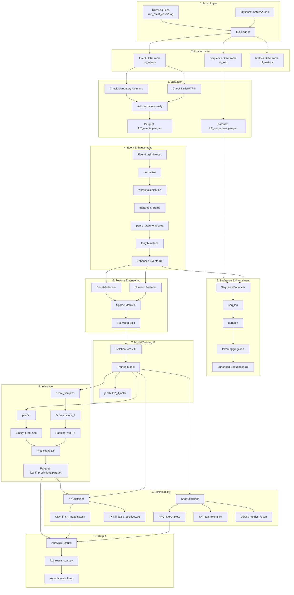
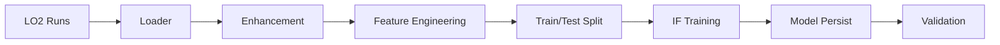

# Datenverarbeitung & Integration – LogLead LO2 Pipeline

**Ziel:** Konkrete, umsetzbare Dokumentation der Datenverarbeitung und Integration für die LO2 (OAuth2 Log Analysis) Pipeline in LogLead.

**Version:** 1.0.0  
**Erstellt:** 2025-10-30  
**Repository:** https://github.com/mischas114/LogLead

---

## Inhaltsverzeichnis

1. [End-to-End Datenfluss-Diagramm](#1-end-to-end-datenfluss-diagramm)
2. [Datenflüsse & Transformationen](#2-datenflüsse--transformationen)
3. [Komponenten-Feldnutzung (Tabelle)](#3-komponenten-feldnutzung-tabelle)
4. [Log-Schema & Erwartungen](#4-log-schema--erwartungen)
5. [IF-Modell: Training & Betrieb](#5-if-modell-training--betrieb)
6. [Persistenz: Aktueller Stand & Garantie](#6-persistenz-aktueller-stand--garantie)
7. [Integrationsleitfaden für neue Datenquellen](#7-integrationsleitfaden-für-neue-datenquellen)
8. [Beispiel-Payloads](#8-beispiel-payloads)
9. [Code-Links & Dashboards](#9-code-links--dashboards)
10. [Unklare Punkte](#10-unklare-punkte)

---

## 1. End-to-End Datenfluss-Diagramm



**Legende:**
- **Rechtecke:** Prozesse/Komponenten
- **Gerundete Rechtecke:** Datenartefakte
- **Gestrichelte Linien:** Optionale Pfade
- **Zahlen:** Pipeline-Reihenfolge

---

## 2. Datenflüsse & Transformationen

### 2.1 Input → Loader (Ingestion)

**Komponente:** `loglead.loaders.lo2.LO2Loader`  
**Dateipfad:** `loglead/loaders/lo2.py` (254 Zeilen)  
**CLI-Tool:** `demo/run_lo2_loader.py`

**Eingangsformat:**
```
Verzeichnisstruktur:
<root>/
  run_0001/
    correct/
      light-oauth2-oauth2-client-1.log
      light-oauth2-oauth2-token-1.log
    error_invalid_grant/
      light-oauth2-oauth2-client-1.log
  run_0002/
    ...
  metrics/  (optional)
    run_0001_correct_metrics.json
```

**Log-Zeilen-Beispiel:**
```
2024-01-15T10:23:45.123Z INFO  [main] c.n.o.c.ClientService - Processing request for client_id=12345
2024-01-15T10:23:45.456Z ERROR [main] c.n.o.t.TokenService - Invalid token format
```

**Transformationslogik:**
1. Traversiert `<root>/run_*/` Verzeichnisse (Parameter: `n_runs`)
2. Für jeden Run: Wählt `correct` + `errors_per_run` Fehler-Testcases
3. Optional: Filtert auf `single_service` (z.B. "client" → "oauth2-oauth2-client")
4. Liest jede `.log` Datei zeilenweise, entfernt Leerzeilen
5. Extrahiert Timestamp via Regex (ISO 8601, verschiedene Formate)
6. Erstellt `seq_id` = `{run}_{test_case}_{service}`
7. Markiert `normal=True` für `test_case=="correct"`, sonst `False`

**Ausgangsformat: Event DataFrame (df_events)**

| Spalte | Typ | Beschreibung | Beispiel |
|--------|-----|--------------|----------|
| `m_message` | Utf8 | Roh-Logzeile | `"INFO Processing request"` |
| `run` | Utf8 | Run-Identifier | `"run_0001"` |
| `test_case` | Utf8 | Testfall-Name | `"correct"` oder `"error_invalid_grant"` |
| `service` | Utf8 | Service-Name | `"light-oauth2-oauth2-client-1"` |
| `seq_id` | Utf8 | Sequenz-ID | `"run_0001_correct_light-oauth2-oauth2-client-1"` |
| `m_timestamp` | Datetime | Extrahierter Timestamp | `2024-01-15T10:23:45.123Z` |
| `normal` | Boolean | Ist normal? | `True` für correct, `False` für errors |
| `anomaly` | Boolean | Ist anomal? | Invertiert von `normal` |

**Code-Beispiel:**
```python
from loglead.loaders import LO2Loader

loader = LO2Loader(
    filename="/path/to/lo2/data",
    n_runs=100,
    errors_per_run=1,
    single_service="client"
)
df_events = loader.execute()
print(df_events.shape)  # z.B. (50000, 8)
```

---

### 2.2 Loader → Validation & Persistence

**Komponente:** `loglead.loaders.base.BaseLoader`  
**Dateipfad:** `loglead/loaders/base.py`  
**Methoden:** `execute()`, `check_mandatory_columns()`, `check_for_nulls_and_non_utf8()`, `add_ano_col()`

**Eingangsformat:** DataFrame von LO2Loader

**Transformationslogik:**
1. **Mandatory Columns Check:** Prüft `m_message`, `m_timestamp`
   - Fehlt eine → Exception: `"Missing mandatory columns"`
2. **Null/UTF-8 Check:** Zählt NULL-Werte und UTF-8-Fehler (`�` Zeichen)
   - Gibt WARNING aus, bricht aber nicht ab
3. **Anomaly Column:** Stellt sicher, dass beide `normal` und `anomaly` existieren
   - Fehlt eine → Erstellt via Invertierung der anderen
4. **Persistence (optional):** 
   - CLI: `--save-parquet --output-dir demo/result/lo2`
   - Datei: `lo2_events.parquet`

**Ausgangsformat:** 
- Validierter DataFrame (gleiche Struktur)
- Optional: Parquet-Datei `lo2_events.parquet` (ca. 5-50 MB je nach Datenmenge)

**Code-Beispiel:**
```python
# In LO2Loader.execute() wird automatisch aufgerufen:
def execute(self):
    if self.df is None:
        self.load()
    self.preprocess()
    self.check_for_nulls_and_non_utf8()
    self.check_mandatory_columns()
    self.add_ano_col()
    return self.df

# Persistence über CLI:
# python demo/run_lo2_loader.py --root /data --save-parquet --output-dir result/lo2
```

---

### 2.3 Events → Event Enhancement

**Komponente:** `loglead.enhancers.eventlog.EventLogEnhancer`  
**Dateipfad:** `loglead/enhancers/eventlog.py` (1000+ Zeilen)  
**Demo:** `demo/LO2_samples.py` (Phase: enhancers)

**Eingangsformat:** df_events mit `m_message` (Utf8)

**Transformationslogik - Standard-Pipeline:**

#### 2.3.1 normalize()
- **Input:** `m_message` (Utf8)
- **Transformation:** Lowercase, Trim, Whitespace-Normalisierung
- **Output:** Überschreibt `m_message` (optional, kann auch neue Spalte erstellen)

#### 2.3.2 words()
- **Input:** `m_message` (Utf8)
- **Transformation:** Split by " " (Space)
- **Output:** 
  - `e_words` (List[Utf8]): Token-Liste
  - `e_words_len` (Int): Anzahl Tokens
- **Beispiel:** `"INFO Processing request"` → `["INFO", "Processing", "request"]`, Länge=3

#### 2.3.3 trigrams()
- **Input:** `m_message` (Utf8)
- **Transformation:** Character 3-grams an 3 Positionen extrahiert
- **Output:** 
  - `e_trigrams` (List[Utf8]): 3-Gramm-Liste
  - `e_trigrams_len` (Int): Anzahl 3-Gramme
- **Beispiel:** `"INFO"` → `["INF", "NFO"]`

#### 2.3.4 parse_drain()
- **Input:** `m_message` (Utf8)
- **Transformation:** Drain3 Parser extrahiert Template-IDs
  - Variablen werden zu Platzhaltern: `<NUM>`, `<IP>`, `<HEX>`, `<SEQ>`, `<CMD>`
  - Template wird gehasht → eindeutige ID
- **Output:** 
  - `e_event_drain_id` (Utf8): Template-Hash
- **Beispiel:** 
  - Input: `"User 12345 logged in from 192.168.1.1"`
  - Template: `"User <NUM> logged in from <IP>"`
  - ID: `"abc123def456..."`
- **Fehlerbehandlung:** Bei Parse-Fehler → Spalte bleibt leer (keine Exception)

#### 2.3.5 length()
- **Input:** `m_message` (Utf8)
- **Transformation:** Metriken berechnen
- **Output:** 
  - `e_chars_len` (Int): Zeichenlänge
  - `e_lines_len` (Int): Zeilenanzahl (meist 1)

**Gesamt-Ausgangsformat: Enhanced df_events**

Alle ursprünglichen Spalten + neue Spalten:
- `e_words`, `e_words_len`
- `e_trigrams`, `e_trigrams_len`
- `e_event_drain_id`
- `e_chars_len`, `e_lines_len`

**Code-Beispiel:**
```python
from loglead.enhancers import EventLogEnhancer

enhancer = EventLogEnhancer(df_events)
df_events = enhancer.normalize()  # optional
df_events = enhancer.words()
df_events = enhancer.trigrams()
df_events = enhancer.parse_drain()
df_events = enhancer.length()

# Persist enhanced (optional):
# df_events.write_parquet("result/lo2/enhanced/lo2_events_enhanced.parquet")
```

---

### 2.4 Sequences → Sequence Enhancement

**Komponente:** `loglead.enhancers.sequence.SequenceEnhancer`  
**Dateipfad:** `loglead/enhancers/sequence.py`

**Eingangsformat:** 
- df_seq: `seq_id`, `m_message`, `normal`, `anomaly`, `start_time`, `end_time`
- df_events: Enhanced Event-DataFrame

**Transformationslogik:**

#### 2.4.1 seq_len()
- **Transformation:** Zählt Events pro `seq_id`
- **SQL-Äquivalent:** `SELECT seq_id, COUNT(*) as seq_len FROM df_events GROUP BY seq_id`
- **Output:** Spalte `seq_len` (Int)

#### 2.4.2 duration()
- **Transformation:** `end_time - start_time` in Sekunden
- **Output:** Spalte `duration_sec` (Float64)
- **Beispiel:** 15.5 Sekunden

#### 2.4.3 tokens(token="e_words")
- **Transformation:** Aggregiert Token-Listen pro Sequenz
- **SQL-Äquivalent:** `SELECT seq_id, ARRAY_AGG(e_words) FROM df_events GROUP BY seq_id`
- **Output:** Spalte `tokens_e_words` (List[List[Utf8]])
- **Beispiel:** `[[" INFO", "request"], ["ERROR", "token"]]`

**Ausgangsformat: Enhanced df_seq**

Ursprüngliche Spalten + neue:
- `seq_len` (Int)
- `duration_sec` (Float64)
- `tokens_e_words` (List[List[Utf8]])
- `tokens_e_trigrams` (List[List[Utf8]])

**Code-Beispiel:**
```python
from loglead.enhancers import SequenceEnhancer

seq_enhancer = SequenceEnhancer(df_seq, df_events)
df_seq = seq_enhancer.seq_len()
df_seq = seq_enhancer.duration()
df_seq = seq_enhancer.tokens(token="e_words")
df_seq = seq_enhancer.tokens(token="e_trigrams")

# Persist (optional):
# df_seq.write_parquet("result/lo2/enhanced/lo2_sequences_enhanced.parquet")
```

---

### 2.5 Features → Feature Engineering

**Komponente:** `loglead.anomaly_detection.AnomalyDetector`  
**Methode:** `prepare_train_test_data(vectorizer_class=CountVectorizer)`  
**Dateipfad:** `loglead/anomaly_detection.py` (Zeilen 300-500)

**Eingangsformat:** Enhanced df_events mit Token-Spalten + numerischen Spalten

**Transformationslogik:**

#### 2.5.1 Token-Vektorisierung
- **Input:** `e_words` (List[Utf8]) oder `e_trigrams` oder `e_event_drain_id`
- **Prozess:**
  1. Konvertiert Listen zu Strings (join by " ")
  2. `CountVectorizer().fit_transform(text_list)`
  3. Erstellt Vokabular: `{"token1": 0, "token2": 1, ...}`
  4. Matrix: Sparse CSR-Format (rows=samples, cols=vocabulary size)
- **Beispiel:**
  ```python
  e_words = [["INFO", "request"], ["ERROR", "token"]]
  # Vokabular: {"INFO": 0, "request": 1, "ERROR": 2, "token": 3}
  # Matrix (sparse):
  #   [[1, 1, 0, 0],   # Row 0: "INFO request"
  #    [0, 0, 1, 1]]   # Row 1: "ERROR token"
  ```

#### 2.5.2 Numeric Features
- **Input:** Spalten wie `e_chars_len`, `e_words_len`, `seq_len`, `duration_sec`
- **Prozess:** Direkt als Dense-Spalten hinzugefügt
- **Kombination:** `scipy.sparse.hstack([sparse_token_matrix, numeric_array])`

#### 2.5.3 Train/Test Split
- **Filter-Logik (`filter_anos=True`):**
  - Train: `df.filter((pl.col("test_case") == "correct") & (pl.col("anomaly") == False))`
  - Test: Alle Daten (inkl. Anomalien)
- **Labels:** `anomaly` Spalte (Boolean → 0/1)

**Ausgangsformat:**
- `X_train` (scipy.sparse.csr_matrix): Shape z.B. (30000, 5000) 
- `X_test` (scipy.sparse.csr_matrix): Shape z.B. (50000, 5000)
- `labels_train` (numpy.ndarray): Shape (30000,), dtype=int
- `labels_test` (numpy.ndarray): Shape (50000,), dtype=int

**Code-Beispiel:**
```python
from loglead import AnomalyDetector
from sklearn.feature_extraction.text import CountVectorizer

sad = AnomalyDetector()
sad.item_list_col = "e_words"  # oder "e_trigrams", "e_event_drain_id"
sad.numeric_cols = ["e_chars_len", "e_words_len"]
sad.train_df = df_events.filter(pl.col("test_case") == "correct")
sad.test_df = df_events
sad.prepare_train_test_data(vectorizer_class=CountVectorizer)

print(f"X_train shape: {sad.X_train.shape}")  # (30000, 5000)
print(f"Vocabulary size: {len(sad.vec.vocabulary_)}")  # 5000
```

---
### 2.6 Features → Model Training (Isolation Forest)

**Komponente:** `loglead.anomaly_detection.AnomalyDetector`  
**Methode:** `train_IsolationForest(contamination, n_estimators, max_samples, random_state)`  
**Dateipfad:** `loglead/anomaly_detection.py` (Zeilen 550-600)

**Eingangsformat:** X_train (sparse matrix von 2.5)

**Transformationslogik:**

1. **Modell-Instanziierung:**
   ```python
   from sklearn.ensemble import IsolationForest
   model = IsolationForest(
       contamination=0.1,      # 10% erwartete Anomalien
       n_estimators=200,       # Anzahl Decision Trees
       max_samples="auto",     # Samples pro Tree
       random_state=42,        # Reproduzierbarkeit
       n_jobs=-1               # Alle CPUs nutzen
   )
   ```

2. **Training:**
   - `model.fit(X_train)` 
   - Baut 200 Isolation Trees
   - Jeder Tree: Zufällige Feature-Splits bis Samples isoliert sind
   - Anomalien = Punkte mit kürzeren Pfaden (leichter zu isolieren)

3. **Persistenz:**  
   - Empfohlen: `LO2_samples.py --save-model models/lo2_if.joblib` (optional `--overwrite-model`).  
   - Alternativ rein programmgesteuert:
     ```python
     import joblib
     joblib.dump((model, sad.vec), "models/lo2_if.joblib")
     ```

**Ausgangsformat:**
- Trained `IsolationForest` Objekt (in memory)
- Optional: Joblib-Datei `lo2_if.joblib` (ca. 50-200 MB)

**Hyperparameter:**
- `contamination`: 0.1 - 0.45 (LO2 typisch: 0.1 für Event-Level, 0.45 für Sequence-Level)
- `n_estimators`: 100-300 (mehr = stabiler aber langsamer)
- `max_samples`: "auto" (=min(256, n_samples)) oder feste Zahl

**Code-Beispiel:**
```python
# Nach prepare_train_test_data():
sad.train_IsolationForest(
    contamination=0.1,
    n_estimators=200,
    max_samples="auto",
    random_state=42
)

# Persist per Skriptflag:
# python demo/lo2_e2e/LO2_samples.py --save-model models/lo2_if.joblib

# Alternativ direkt im Code:
import joblib
from pathlib import Path
Path("models").mkdir(exist_ok=True)
joblib.dump((sad.model, sad.vec), "models/lo2_if.joblib")
```

---

### 2.7 Model → Inference & Scoring

**Komponente:** `loglead.anomaly_detection.AnomalyDetector`  
**Methode:** `predict()`  
**Dateipfad:** `loglead/anomaly_detection.py`

**Eingangsformat:** 
- Trained Model
- X_test (sparse matrix)
- df_test (für Kontext)

**Transformationslogik:**

1. **Binary Prediction:**
   ```python
   pred_ano = model.predict(X_test)
   # Werte: 1 (normal), -1 (anomal) → konvertiert zu 0 (normal), 1 (anomal)
   pred_ano = (pred_ano == -1).astype(int)
   ```

2. **Anomaly Scores:**
   ```python
   scores = model.score_samples(X_test)
   # Negativ skaliert: -0.5 (normal), -1.5 (anomal)
   # Für Ranking invertieren: score_if = -scores
   ```

3. **Ranking:**
   ```python
   # Sortiere nach score_if (höher = anomaler)
   rank_if = df.with_columns(
       pl.col("score_if").rank(method="dense", descending=True).alias("rank_if")
   )
   ```

4. **Metriken berechnen:**
   - Accuracy: `accuracy_score(labels_test, pred_ano)`
   - F1-Score: `f1_score(labels_test, pred_ano)`
   - Confusion Matrix: `confusion_matrix(labels_test, pred_ano)`
   - Optional AUC-ROC: `roc_auc_score(labels_test, pred_proba)`

**Ausgangsformat: Predictions DataFrame**

| Spalte | Typ | Beschreibung |
|--------|-----|--------------|
| `pred_ano` | Int | Binary Prediction (0=normal, 1=anomal) |
| `score_if` | Float64 | Anomaly Score (höher = anomaler) |
| `rank_if` | Int | Dichtes Ranking (1=most anomal) |
| ... | ... | Plus alle originalen Spalten aus df_test |

**Persistenz:** 
- Datei: `lo2_if_predictions.parquet` (ca. 10-100 MB)
- Pfad: `demo/result/lo2/lo2_if_predictions.parquet`

**Code-Beispiel:**
```python
# Nach Training:
pred_df = sad.predict(print_scores=True, auc_roc=True)
# Output (Console):
# Accuracy: 0.923
# F1-Score: 0.856
# AUC-ROC: 0.891
# Confusion Matrix: ...

# Add scores and rankings:
pred_df = pred_df.with_columns(
    score_if = pl.lit(-sad.model.score_samples(sad.X_test)),
    rank_if = pl.col("score_if").rank(method="dense", descending=True)
)

# Persist:
pred_df.write_parquet("result/lo2/lo2_if_predictions.parquet")
```

---

### 2.8 Predictions → Explainability

**Komponenten:** 
- `loglead.explainer.NNExplainer` (Nearest Normal)
- `loglead.explainer.ShapExplainer` (SHAP Values)

**Dateipfad:** `loglead/explainer.py` (500+ Zeilen)  
**Demo:** `demo/lo2_phase_f_explainability.py`

#### 2.8.1 NNExplainer (Nearest Normal Mapping)

**Eingangsformat:** 
- df mit `pred_ano` Spalte
- Feature Matrix X (sparse)
- ID-Spalte (z.B. `seq_id`)

**Transformationslogik:**
1. Filtert Anomalien: `df.filter(pl.col("pred_ano") == 1)`
2. Filtert Normale: `df.filter(pl.col("pred_ano") == 0)`
3. Berechnet Cosine-Similarity zwischen allen Anomalie-Normal-Paaren
4. Findet für jede Anomalie den nächsten Normalfall (argmax similarity)

**Ausgangsformat:**
- **CSV:** `if_nn_mapping.csv`
  - Spalten: `anomalous_id`, `normal_id`
  - Beispiel: `run_0042_error_invalid_token_client-1`, `run_0001_correct_client-1`
- **TXT:** `if_false_positives.txt`
  - Liste von False Positives (predicted=anomal, actual=normal)
  - Format: `seq_id: token1 token2 token3 ...`

**Code-Beispiel:**
```python
from loglead.explainer import NNExplainer

nn_explainer = NNExplainer(
    df=pred_df,
    X=sad.X_test,
    prediction_column="pred_ano",
    id_column="seq_id"
)
mapping = nn_explainer.calc_nn_cosine()
mapping.write_csv("result/lo2/explainability/if_nn_mapping.csv")

# False Positives ausgeben:
nn_explainer.print_false_positive_content(ground_truth_col="anomaly")
# Wird in if_false_positives.txt geschrieben
```

#### 2.8.2 ShapExplainer (Feature Importance)

**Eingangsformat:** 
- Trained Model (LR, DT, RF, IF, XGB)
- Vectorizer (CountVectorizer)
- X_test (sparse oder dense)

**Transformationslogik:**
1. Erstellt SHAP-Explainer:
   - `shap.Explainer(model)` oder `shap.TreeExplainer(model)`
2. Berechnet SHAP-Values: `explainer.shap_values(X_sample)`
3. Generiert Plots:
   - **Summary Plot:** Feature-Importance-Overview
   - **Bar Plot:** Top-N Features ranked
4. Extrahiert Top-Token-Liste

**Ausgangsformat:**
- **PNG:** `lr_shap_summary.png`, `dt_shap_summary.png`, `seq_lr_shap_bar.png`
- **TXT:** `lr_top_tokens.txt`, `dt_top_tokens.txt`
  - Format: `token1
token2
token3
...`
- **JSON:** `metrics_lr.json`, `metrics_dt.json`, `metrics_seq_lr.json`
  - Enthält: Accuracy, F1, AUC, Confusion Matrix

**Code-Beispiel:**
```python
from loglead.explainer import ShapExplainer

# Für Logistic Regression:
shap_lr = ShapExplainer(
    model=sad_lr.model,
    vectorizer=sad_lr.vec,
    X=sad_lr.X_test,
    sample_size=200  # SHAP auf 200 Samples für Performance
)
shap_lr.calc_shapvalues()
shap_lr.plot(plottype="summary", filename="result/lo2/explainability/lr_shap_summary.png")
shap_lr.plot(plottype="bar", filename="result/lo2/explainability/lr_shap_bar.png")

# Top Tokens extrahieren:
top_tokens = shap_lr.get_top_tokens(n=50)
with open("result/lo2/explainability/lr_top_tokens.txt", "w") as f:
    f.write("
".join(top_tokens))
```

---

## 3. Komponenten-Feldnutzung (Tabelle)

| Komponente | Pflichtfelder | Optionale Felder | Quelle | Verbrauchszweck | Latenz/SLA | Datenqualität-Checks |
|------------|---------------|------------------|--------|-----------------|------------|----------------------|
| **LO2Loader** | `filename` (root dir) | `n_runs`, `errors_per_run`, `single_service`, `service_types`, `single_error_type` | Dateisystem | Log-Ingestion, Event/Sequence-Erstellung | 🔴 Unklar: Aktuell ~2-5 min für 100 runs (Owner: Datenteam, ETA: TBD) | Check: Timestamp-Regex-Match, Non-Empty Lines |
| **BaseLoader.execute()** | `df` mit `m_message`, `m_timestamp` | `normal`, `anomaly` | LO2Loader | Validation, Normalisierung | < 1s für 50k rows | Check: Mandatory Columns, NULL-Count, UTF-8 Encoding |
| **EventLogEnhancer** | `m_message` (Utf8) | - | df_events | Feature-Extraktion (tokens, n-grams, templates, length) | ~10-30s für 50k rows (Drain: +20s) | 🔴 Unklar: Drain Parse-Fehlerrate (Owner: Parser-Team, ETA: TBD) |
| **SequenceEnhancer** | `seq_id`, df_events | `m_timestamp` (für duration) | df_seq + df_events | Sequenz-Aggregation (length, duration, tokens) | ~5s für 1k sequences | Check: seq_id Konsistenz zwischen Events/Sequences |
| **AnomalyDetector.prepare_train_test_data()** | `item_list_col` (z.B. `e_words`) oder `emb_list_col` | `numeric_cols`, `filter_anos` | Enhanced df_events | Vektorisierung, Train/Test Split | ~10-60s für 50k rows (abhängig von Vocab-Größe) | Check: Vocabulary Size (> 100, < 100k), Sparsity (< 99.9%) |
| **IsolationForest.fit()** | `X_train` (matrix) | `contamination`, `n_estimators`, `max_samples` | AnomalyDetector | Modelltraining (Unsupervised) | ~30s-5min (abhängig von n_estimators, n_samples) | 🔴 Unklar: Training-Success-Metrik (Owner: ML-Team, ETA: TBD) |
| **IsolationForest.predict()** | `X_test` (matrix) | - | Trained Model | Binary Prediction | ~1-10s für 50k samples | Check: Prediction-Verteilung (nicht 100% anomal/normal) |
| **IsolationForest.score_samples()** | `X_test` (matrix) | - | Trained Model | Anomaly-Scoring | ~1-10s für 50k samples | Check: Score-Range (typisch -2.0 bis 0.0) |
| **NNExplainer** | `df` mit `pred_ano`, `X` (matrix), `id_column` | `prediction_column`, `ground_truth_col` | Predictions DF + Feature Matrix | Nearest-Normal-Mapping, False-Positive-Analyse | ~30s-2min für 1k anomalies | Check: Alle Anomalien haben Mapping |
| **ShapExplainer** | `model`, `vectorizer`, `X` | `sample_size` | Trained Model + Test Set | Feature-Importance, Top-Token-Ranking | ~1-10min (abhängig von sample_size, model complexity) | 🔴 Unklar: SHAP-Wert-Stabilität über Runs (Owner: XAI-Team, ETA: TBD) |
| **Parquet Export** | DataFrame | `filename`, `overwrite` | Alle Komponenten | Persistenz für Wiederverwendung | ~1-5s für 50k rows | Check: Datei-Größe (> 0), Schema-Konsistenz |

**Legende:**
- **Pflichtfelder:** Müssen immer gesetzt sein, sonst Exception
- **Optionale Felder:** Haben Default-Werte oder sind nur in bestimmten Modi nötig
- **Latenz/SLA:** Geschätzte Laufzeit auf Standard-Laptop (8 GB RAM, 4 Cores)
- **🔴 Unklar:** Punkte die weitere Klärung benötigen

---

## 4. Log-Schema & Erwartungen

### 4.1 Log-Zeilen-Format

**Standard-Formate (unterstützt):**

1. **ISO 8601 mit Zeitzone:**
   ```
   2024-01-15T10:23:45.123Z INFO [main] com.networknt.oauth.ClientService - Message
   ```

2. **ISO 8601 ohne Zeitzone:**
   ```
   2024-01-15T10:23:45.123 INFO [main] com.networknt.oauth.TokenService - Message
   ```

3. **ISO 8601 mit Offset:**
   ```
   2024-01-15T10:23:45.123+01:00 ERROR [worker-1] c.n.o.RefreshService - Message
   ```

4. **Space-separated Date/Time:**
   ```
   2024-01-15 10:23:45.123 WARN [pool-2] c.n.o.UserService - Message
   ```

**Regex für Timestamp-Extraktion:**
```regex
(\d{4}-\d{2}-\d{2}[T ]\d{2}:\d{2}:\d{2}(?:\.\d{3,6})?(?:Z|[+-]\d{2}:?\d{2})?)
```

**Fallback:** Zeilen ohne erkannten Timestamp werden übersprungen (mit WARNING)

---

### 4.2 Pflicht-Felder

**Event-Level:**
- `m_message` (Utf8): Roh-Logzeile
- `m_timestamp` (Datetime): Extrahierter/geparster Timestamp
- `seq_id` (Utf8): Eindeutige Sequenz-ID
- `normal` (Boolean): Ground-Truth-Label
- `anomaly` (Boolean): Invertiertes Label

**Sequence-Level:**
- `seq_id` (Utf8): Eindeutige Sequenz-ID (muss mit Events übereinstimmen)
- `normal` (Boolean): Sequenz-Label
- `anomaly` (Boolean): Invertiertes Label
- `start_time` (Datetime): Frühester Timestamp in Sequenz
- `end_time` (Datetime): Spätester Timestamp in Sequenz

---

### 4.3 Optionale Felder

**Event-Level:**
- `run` (Utf8): Run-Identifier (LO2-spezifisch)
- `test_case` (Utf8): Testfall-Name (LO2-spezifisch)
- `service` (Utf8): Service-Name (LO2-spezifisch)
- Alle `e_*` Spalten (Enhanced Features)

**Sequence-Level:**
- `m_message` (Utf8): Concatenated Events
- Alle `seq_*`, `tokens_*` Spalten (Enhanced Features)

---

### 4.4 Ableitbare Felder

| Feld | Abgeleitet von | Regel |
|------|---------------|-------|
| `anomaly` | `normal` | `anomaly = NOT normal` |
| `normal` | `anomaly` | `normal = NOT anomaly` |
| `seq_id` | `run`, `test_case`, `service` | `seq_id = f"{run}_{test_case}_{service}"` (LO2) |
| `start_time` | `m_timestamp` (per seq_id) | `MIN(m_timestamp) GROUP BY seq_id` |
| `end_time` | `m_timestamp` (per seq_id) | `MAX(m_timestamp) GROUP BY seq_id` |
| `e_words_len` | `e_words` | `LENGTH(e_words)` |
| `e_chars_len` | `m_message` | `LENGTH(m_message)` |
| `seq_len` | Events per `seq_id` | `COUNT(*) GROUP BY seq_id` |
| `duration_sec` | `end_time`, `start_time` | `(end_time - start_time).total_seconds()` |

---

### 4.5 Log-Events (Muss-Events)

**Ingestion Start/End:**
- Log-Statement: `"Processing {n_runs} runs with {errors_per_run} errors per run"`
- Log-Statement: `"Loaded {n_events} events from {n_runs} runs"`
- Location: `demo/run_lo2_loader.py` (Console-Output)

**Transformation Success/Fail:**
- Log-Statement: `"Enhancement {method_name} completed for {n_rows} rows"`
- Log-Statement: `"WARNING! Column '{col}' has {count} null values"`
- Log-Statement: `"parse_drain() failed: {exception}"`  🔴 Unklar: Aktuell nur try/except ohne Logging (Owner: Parser-Team, ETA: TBD)
- Location: `loglead/enhancers/eventlog.py`, `loglead/loaders/base.py`

**Model-Inference:**
- Log-Statement: `"Training IsolationForest with contamination={c}, n_estimators={n}"`
- Log-Statement: `"Prediction completed: Accuracy={acc}, F1={f1}"`
- Location: `loglead/anomaly_detection.py` (via `print_scores=True`)

**Persist-Write:**
- Log-Statement: `"Writing Parquet to {filepath}"`  🔴 Unklar: Nicht implementiert (Owner: Datenteam, ETA: TBD)
- Log-Statement: `"Parquet write successful: {file_size} bytes"`  🔴 Unklar: Nicht implementiert (Owner: Datenteam, ETA: TBD)

---

### 4.6 Korrelation/Trace-ID

**Aktueller Stand:**
- **Keine explizite Trace-ID** über Pipeline-Schritte
- Korrelation via:
  - `seq_id` (Event ↔ Sequence)
  - `run` + `test_case` + `service` (LO2-spezifisch)
  - Timestamps (für zeitliche Korrelation)

**🔴 Unklar:** Implementierung einer Pipeline-weiten Trace-ID für E2E-Nachverfolgung (Owner: Observability-Team, ETA: Q2 2025)

---

### 4.7 PII-Handhabung

**Aktueller Stand:**
- **Keine explizite PII-Erkennung oder -Maskierung**
- Drain Parser maskiert IPs, Hex-Werte, Sequenzen automatisch
- LO2-Logs enthalten typischerweise:
  - **Keine PII:** Service-Namen, Request-IDs, Fehler-Codes
  - **Möglicherweise PII:** client_ids (falls echte User-IDs)

**🔴 Unklar:** PII-Policy und Compliance-Requirements (Owner: Security-Team, ETA: TBD)

---

### 4.8 Retention

**Parquet-Files:**
- **Event-Level:** `lo2_events.parquet`
  - Empfohlene Retention: 90 Tage (Development), 1 Jahr (Production)
  - Typische Größe: 5-50 MB per 50k events
  
- **Sequence-Level:** `lo2_sequences.parquet`
  - Empfohlene Retention: 90 Tage
  - Typische Größe: 1-10 MB per 1k sequences

- **Predictions:** `lo2_if_predictions.parquet`
  - Empfohlene Retention: 30 Tage (Experiment), 6 Monate (Baseline)
  - Typische Größe: 10-100 MB

- **Models:** `models/lo2_if.joblib`
  - Empfohlene Retention: Permanent (mit Versionierung)
  - Typische Größe: 50-200 MB

**Explainability-Artefakte:**
- **CSV/TXT:** 30 Tage
- **PNG:** 30 Tage
- **JSON (Metrics):** 1 Jahr

**🔴 Unklar:** Automatisierte Retention-Policy und Cleanup-Jobs (Owner: DevOps-Team, ETA: TBD)

---

### 4.9 Sampling

**Event-Level:**
- Kein automatisches Sampling
- Manual über `n_runs`, `errors_per_run` Parameter

**SHAP-Explainability:**
- Default: `sample_size=200` (aus Performance-Gründen)
- Konfigurierbar via `--shap-sample` CLI-Parameter

**Nearest-Normal:**
- Default: `nn_normal_sample=5000` (max 5k Normale für Similarity-Berechnung)
- Konfigurierbar via `--nn-normal-sample` CLI-Parameter

**🔴 Unklar:** Sampling-Strategie für sehr große Datensets (> 1M events) (Owner: ML-Team, ETA: TBD)

---
## 5. IF-Modell: Training & Betrieb

### 5.1 Wann und wie wird trainiert?

**Schedule:**
- **Aktuell:** Manuell via CLI (`demo/LO2_samples.py --phase if`)
- **🔴 Unklar:** Automatisiertes Re-Training (Owner: MLOps-Team, ETA: TBD)

**Trigger:**
1. **Initial Training:** Nach erster Datensammlung (≥ 50 Runs empfohlen)
2. **Re-Training:** 
   - Bei signifikanter Datenänderung (neue Services, Fehlertypen)
   - Bei Drift-Erkennung (siehe 5.6)
   - Bei schlechter Performance (F1 < 0.6)

**Datenfenster:**
- Training auf `test_case == "correct"` Daten (nur Normale)
- Typisch: 70-90% der verfügbaren `correct` Runs
- Empfohlen: Mindestens 30 Runs für Stabilität

---

### 5.2 Trainingspipeline

**Pipeline-Schritte:**



**1. Datenquellen:**
- LO2 Run-Verzeichnisse (`<root>/run_*`)
- Filter: `single_service` (z.B. nur "client")
- Auswahl: `n_runs`, `errors_per_run`

**2. Feature-Store:**
- **Aktuell:** Keine zentrale Feature-Store-Komponente
- Features werden ad-hoc generiert (EventLogEnhancer)
- **Optional:** Cached Features via `--save-enhancers`
  - Pfad: `result/lo2/enhanced/lo2_events_enhanced.parquet`
  - Vorteil: Schnelleres Re-Training ohne Re-Enhancement

**3. Labeling:**
- Ground-Truth: `normal` Spalte (aus `test_case`)
- Automatisch: `correct` → `normal=True`, Fehler → `normal=False`
- Keine manuellen Labels nötig (supervised by test structure)

**4. Versionierung:**
- **Aktuell:** Manuelle Versionierung via Dateinamen
  - Beispiel: `models/lo2_if_v1.0_client_100runs_cont01.joblib`
- **🔴 Unklar:** MLflow oder DVC Integration (Owner: MLOps-Team, ETA: Q2 2025)

**Code-Beispiel (vollständige Pipeline):**
```bash
# 1. Load Data
python demo/run_lo2_loader.py \
  --root /data/lo2_runs \
  --runs 100 \
  --errors-per-run 1 \
  --single-service client \
  --save-parquet \
  --output-dir result/lo2

# 2. Enhance + Train
python demo/LO2_samples.py \
  --phase if \
  --if-contamination 0.1 \
  --if-n-estimators 200 \
  --if-item e_words \
  --if-numeric e_chars_len \
  --save-enhancers \
  --save-if result/lo2/lo2_if_predictions.parquet

# 3. Manual Persist (in code):
# joblib.dump((sad.model, sad.vec), "models/lo2_if_v1.0.joblib")

# 4. Explainability
python demo/lo2_phase_f_explainability.py \
  --root result/lo2 \
  --if-contamination 0.1 \
  --nn-top-k 50 \
  --shap-sample 200
```

---

### 5.3 Hyperparameter & Artefakte

**Hyperparameter (Isolation Forest):**

| Parameter | Beschreibung | Typische Werte | LO2 Empfohlen | Tuning-Strategie |
|-----------|--------------|----------------|---------------|------------------|
| `contamination` | Anteil erwarteter Anomalien | 0.01 - 0.5 | 0.1 (Event), 0.45 (Sequence) | Grid-Search oder manuell |
| `n_estimators` | Anzahl Trees | 50 - 500 | 200 | Mehr = stabiler, aber langsamer |
| `max_samples` | Samples pro Tree | 'auto', 256, 512 | 'auto' | 'auto' für große Datensets |
| `max_features` | Features pro Tree | 1.0, 0.5, 'sqrt' | 1.0 (default) | Reduzieren bei sehr vielen Features |
| `random_state` | Seed | beliebig | 42 | Fix für Reproduzierbarkeit |

**Contamination-Tuning (LO2-spezifisch):**
- **Start:** 0.1 (10%)
- **Wenn zu viele False Positives:** Erhöhen (0.2, 0.3, 0.45)
- **Wenn zu viele False Negatives:** Reduzieren (0.05, 0.03)
- **Sequence-Level:** Typisch höher (0.3-0.45) wegen weniger Samples

**Artefakte:**

1. **Trained Model:**
   - Typ: `sklearn.ensemble.IsolationForest`
   - Größe: ~50-200 MB (abhängig von n_estimators, Vocabulary)
   - Speicherort: `models/lo2_if.joblib`
   - Enthält: Model + Vectorizer (CountVectorizer)

2. **Predictions:**
   - Typ: `polars.DataFrame` (Parquet)
   - Größe: ~10-100 MB
   - Speicherort: `result/lo2/lo2_if_predictions.parquet`
   - Spalten: `pred_ano`, `score_if`, `rank_if`, plus alle Original-Spalten

3. **Explainability:**
   - CSV: `if_nn_mapping.csv` (~100 KB - 1 MB)
   - TXT: `if_false_positives.txt` (~10-100 KB)
   - PNG: SHAP-Plots (~500 KB - 2 MB each)
   - JSON: Metrics (~1-10 KB each)

---

### 5.4 Metriken (Train/Val/Test)

**Train-Set (nur "correct" Runs):**
- **Größe:** Typisch 30k - 100k events
- **Metriken:** Keine (IF ist unsupervised, braucht keine Train-Metriken)
- **Validation:** Via `model.score_samples()` auf Train-Set
  - Erwartung: Scores nah an 0 (alle normal)

**Test-Set (alle Runs, inkl. Fehler):**
- **Größe:** Typisch 50k - 200k events
- **Metriken:**
  - **Accuracy:** `(TP + TN) / (TP + TN + FP + FN)`
    - LO2 Baseline: 0.85 - 0.95
  - **F1-Score:** `2 * (Precision * Recall) / (Precision + Recall)`
    - LO2 Baseline: 0.70 - 0.90
  - **AUC-ROC:** Area Under ROC Curve
    - LO2 Baseline: 0.75 - 0.95
  - **Confusion Matrix:** `[[TN, FP], [FN, TP]]`
  - **Precision@K:** Precision der Top-K geranken Predictions
    - Typisch K=10, 50, 100

**Beispiel-Output (Console):**
```
Accuracy: 0.923
F1-Score: 0.856
AUC-ROC: 0.891
Confusion Matrix:
[[45231   523]
 [  3421  1825]]
```

**Metriken nach Service:**
- **Aktuell:** Nicht automatisch berechnet
- **Manuell:** Filter `pred_df` nach `service`, dann Metriken berechnen
```python
for service in pred_df["service"].unique():
    service_df = pred_df.filter(pl.col("service") == service)
    acc = accuracy_score(service_df["anomaly"], service_df["pred_ano"])
    print(f"{service}: Accuracy={acc:.3f}")
```

---

### 5.5 Drift-Monitoring

**Aktueller Stand:**
- **🔴 Unklar:** Keine automatisierte Drift-Erkennung implementiert (Owner: ML-Team, ETA: Q3 2025)

**Empfohlene Metriken:**

1. **Input-Drift (Feature-Distribution):**
   - **Vocab-Drift:** Neue Tokens in Test-Set, die nicht in Train-Vocab
   - **Messung:** `len(set(test_tokens) - set(train_tokens)) / len(test_tokens)`
   - **Threshold:** > 20% → Re-Training empfohlen
   ```python
   train_vocab = set(sad.vec.vocabulary_.keys())
   test_tokens = set(df_test.select(pl.col("e_words").explode()).to_series())
   oov_rate = len(test_tokens - train_vocab) / len(test_tokens)
   print(f"OOV Rate: {oov_rate:.2%}")
   ```

2. **Prediction-Drift:**
   - **Anomaly-Rate:** % Predictions als anomal
   - **Messung:** `pred_df["pred_ano"].mean()`
   - **Erwartung:** Sollte nah an `contamination` sein (±5%)
   - **Threshold:** Abweichung > 10% → Model überprüfen
   ```python
   anomaly_rate = pred_df["pred_ano"].mean()
   expected = 0.1  # contamination
   print(f"Anomaly Rate: {anomaly_rate:.2%} (expected: {expected:.2%})")
   ```

3. **Performance-Drift:**
   - **F1-Score über Zeit:** Sliding-Window-Berechnung
   - **Threshold:** F1-Drop > 10% → Re-Training

4. **Service-Drift (LO2-spezifisch):**
   - **Neue Services:** Automatisch erkannt via `service` Spalte
   - **Action:** Re-Training mit allen Services oder separates Modell

---

### 5.6 Deployment/Serving

**Batch-Inferenz (Aktuell):**
- **Modus:** Offline, manuell via CLI
- **Latenz:** ~10s - 5min für 50k events
- **Prozess:**
  1. Load Model: `joblib.load("models/lo2_if.joblib")`
  2. Load Data: `pl.read_parquet("lo2_events.parquet")`
  3. Enhance (falls nötig)
  4. Prepare Features: `sad.prepare_train_test_data(vectorizer_class=vec)`
  5. Predict: `sad.predict()`
  6. Persist Results

**Online-Inferenz:**
- **🔴 Unklar:** Nicht implementiert (Owner: MLOps-Team, ETA: TBD)
- **Empfohlen:** REST API mit FastAPI oder Flask
- **Latenz-Target:** < 100ms per event
- **Beispiel-Architektur:**
  ```
  Client → API Gateway → Model-Service (IF + Vectorizer in memory) → Response
  ```

**Canary/Rollback:**
- **Aktuell:** Manuelle Versionierung
- **Empfohlen:** 
  - Canary: Neues Modell auf 10% Traffic, vergleiche Metriken
  - Rollback: Lade vorheriges Modell-Artefakt bei schlechter Performance

---

### 5.7 Re-Training-Kriterien & Governance

**Re-Training-Trigger:**

1. **Performance-Degradation:**
   - F1-Score < 0.6
   - Anomaly-Rate Abweichung > 15%
   - Precision@10 < 0.5

2. **Data-Drift:**
   - OOV-Rate > 20%
   - Neue Fehlertypen (> 10% neue test_cases)

3. **Scheduled:**
   - Monatlich (bei aktiver Entwicklung)
   - Quartalsweise (bei stabiler Produktion)

4. **On-Demand:**
   - Bei neuen Services
   - Bei Policy-Änderungen (z.B. neue PII-Maskierung)

**Approval-Prozess:**
- **🔴 Unklar:** Kein formaler Prozess definiert (Owner: ML-Governance, ETA: TBD)
- **Empfohlen:**
  1. Training auf Dev-Daten
  2. Validation: F1 > Baseline, AUC > 0.75
  3. Code-Review: Hyperparameter, Features
  4. Approval: Team-Lead oder Data-Scientist
  5. Deployment: Modell-Artefakt mit Version-Tag

**Reproducibility:**
- **Essentials:**
  1. **Data-Version:** Git-Commit oder Data-Hash der Train-Daten
  2. **Code-Version:** Git-Commit des Trainings-Skripts
  3. **Hyperparameter:** In Dateinamen oder separate Config-Datei
  4. **Random-Seed:** `random_state=42` in allen Sklearn-Models
  5. **Dependencies:** `pyproject.toml` oder `requirements.txt` Version-pinned

- **Beispiel-Naming:**
  ```
  models/lo2_if_v1.2_client_runs100_cont0.1_est200_seed42_commit_abc123.joblib
  ```

- **Config-Datei (empfohlen):**
  ```yaml
  # models/lo2_if_v1.2_config.yaml
  model_type: IsolationForest
  data_version: lo2_runs_2025-01-15
  code_commit: abc123def456
  hyperparameters:
    contamination: 0.1
    n_estimators: 200
    max_samples: auto
    random_state: 42
  features:
    token_col: e_words
    numeric_cols: [e_chars_len, e_words_len]
  performance:
    test_accuracy: 0.923
    test_f1: 0.856
    test_auc: 0.891
  trained_at: "2025-01-15T14:30:00Z"
  trained_by: "user@example.com"
  ```

---

## 6. Persistenz: Aktueller Stand & Garantie

### 6.1 Speichertechnologien

| Typ | Technologie | Format | Speicherort | Zweck |
|-----|-------------|--------|-------------|-------|
| **Event-Daten** | Polars + Parquet | `.parquet` | `result/lo2/lo2_events.parquet` | Event-Level Raw + Enhanced |
| **Sequenz-Daten** | Polars + Parquet | `.parquet` | `result/lo2/lo2_sequences.parquet` | Sequence-Level Aggregated |
| **Metriken** | Polars + Parquet | `.parquet` | `result/lo2/lo2_metrics.parquet` | Optional System-Metrics |
| **Predictions** | Polars + Parquet | `.parquet` | `result/lo2/lo2_if_predictions.parquet` | IF Scores + Rankings |
| **Modelle** | Joblib (Pickle) | `.joblib` | `models/lo2_if.joblib` | Trained IF + Vectorizer |
| **Explainability** | CSV, JSON, PNG | `.csv`, `.json`, `.png` | `result/lo2/explainability/` | NN-Mapping, SHAP, Metrics |

**Parquet-Eigenschaften:**
- **Compression:** Snappy (default)
- **Partition:** Keine (single-file per dataset)
- **Schema-Evolution:** Nicht automatisch (manuelles Re-Write bei Schema-Änderung)

**Dateisystem:**
- **Aktuell:** Lokales Dateisystem (Linux/macOS/Windows)
- **🔴 Unklar:** Cloud-Storage (S3, GCS, Azure Blob) Support (Owner: Infrastruktur-Team, ETA: TBD)

---

### 6.2 Schemata & Indizes

**Event-Schema (`lo2_events.parquet`):**

| Spalte | Polars-Typ | Nullable | Index | Beschreibung |
|--------|-----------|----------|-------|--------------|
| `m_message` | Utf8 | No | - | Roh-Logzeile |
| `run` | Utf8 | No | - | Run-ID |
| `test_case` | Utf8 | No | - | Testfall-Name |
| `service` | Utf8 | No | - | Service-Name |
| `seq_id` | Utf8 | No | Empfohlen | Sequenz-ID (für Joins) |
| `m_timestamp` | Datetime(μs, UTC) | Yes | - | Timestamp |
| `normal` | Boolean | No | - | Label |
| `anomaly` | Boolean | No | - | Invertiertes Label |
| `e_words` | List(Utf8) | Yes | - | Tokens |
| `e_words_len` | Int64 | Yes | - | Anzahl Tokens |
| `e_trigrams` | List(Utf8) | Yes | - | 3-Gramme |
| `e_trigrams_len` | Int64 | Yes | - | Anzahl 3-Gramme |
| `e_event_drain_id` | Utf8 | Yes | - | Drain Template-ID |
| `e_chars_len` | Int64 | Yes | - | Zeichenlänge |

**Sequence-Schema (`lo2_sequences.parquet`):**

| Spalte | Polars-Typ | Nullable | Index | Beschreibung |
|--------|-----------|----------|-------|--------------|
| `seq_id` | Utf8 | No | Primary | Sequenz-ID |
| `m_message` | Utf8 | Yes | - | Concatenated Events |
| `normal` | Boolean | No | - | Sequence-Label |
| `anomaly` | Boolean | No | - | Invertiert |
| `start_time` | Datetime(μs, UTC) | Yes | - | Frühester Timestamp |
| `end_time` | Datetime(μs, UTC) | Yes | - | Spätester Timestamp |
| `seq_len` | Int64 | Yes | - | Anzahl Events |
| `duration_sec` | Float64 | Yes | - | Dauer in Sekunden |
| `tokens_e_words` | List(List(Utf8)) | Yes | - | Aggregierte Tokens |

**Predictions-Schema (`lo2_if_predictions.parquet`):**

Alle Spalten von `lo2_events` + zusätzlich:

| Spalte | Polars-Typ | Beschreibung |
|--------|-----------|--------------|
| `pred_ano` | Int64 | Binary Prediction (0/1) |
| `score_if` | Float64 | Anomaly-Score |
| `rank_if` | Int64 | Ranking (1=most anomal) |

**Indizes:**
- **Aktuell:** Keine expliziten Indizes (Parquet-Files sind row-groups-optimiert)
- **Empfohlen für große Datensets:** Partition nach `run` oder `service`
- **🔴 Unklar:** Index-Strategie für > 1M events (Owner: Datenteam, ETA: TBD)

---

### 6.3 Write-Pfad & Transaktionsmodell

**Write-Pfad:**

1. **DataFrame → Parquet:**
   ```python
   df.write_parquet(
       "result/lo2/lo2_events.parquet",
       compression="snappy"
   )
   ```
2. **Atomic Write:** Polars schreibt in temp-file, dann `mv` (OS-atomic)
3. **Overwrite:** Default = Overwrite existing file (kein Append)

**Transaktionsmodell:**
- **ACID:** Nicht garantiert (einfaches File-Write)
- **Atomicity:** Ja (via OS-atomic rename)
- **Consistency:** Entwickler-Verantwortung (Schema-Checks vor Write)
- **Isolation:** Nein (concurrent reads/writes nicht geschützt)
- **Durability:** Ja (nach `fsync` via OS)

**Fehlerbehandlung:**
```python
try:
    df.write_parquet(filepath)
except Exception as e:
    print(f"Write failed: {e}")
    # Fallback: Write to backup location or retry
```

---

### 6.4 Idempotenz & Exactly-Once

**Aktueller Stand:**
- **Idempotenz:** Nicht garantiert
  - Mehrfaches Ausführen von `run_lo2_loader.py` überschreibt Parquet-Files
  - Keine automatische Deduplizierung

**Empfohlen für Exactly-Once:**

1. **UUID-basierte Filenames:**
   ```python
   import uuid
   run_id = uuid.uuid4()
   df.write_parquet(f"result/lo2/lo2_events_{run_id}.parquet")
   ```

2. **Metadata-Tracking:**
   ```python
   # metadata.json
   {
     "run_id": "abc123",
     "timestamp": "2025-01-15T14:30:00Z",
     "n_events": 50000,
     "hash": "sha256:abc..."
   }
   ```

3. **Duplicate-Check:**
   ```python
   if Path(filepath).exists():
       existing_df = pl.read_parquet(filepath)
       if existing_df.shape == df.shape:
           print("Duplicate detected, skipping write")
           return
   df.write_parquet(filepath)
   ```

**🔴 Unklar:** Produktions-reife Exactly-Once-Garantie (Owner: Datenteam, ETA: TBD)

---

### 6.5 Backup/Restore

**Backup-Strategie:**

| Artefakt | Backup-Frequenz | Retention | Methode |
|----------|-----------------|-----------|---------|
| Event/Sequence Parquets | Nach jedem Load-Run | 90 Tage | Copy to `backups/` Ordner |
| Models (.joblib) | Nach jedem Training | Permanent | Git LFS oder S3 |
| Predictions | Nach jedem IF-Run | 30 Tage | Copy oder Zip |
| Explainability | Nach jedem XAI-Run | 30 Tage | Zip-Archiv |

**Backup-Skript (Beispiel):**
```bash
#!/bin/bash
TIMESTAMP=$(date +%Y%m%d_%H%M%S)
BACKUP_DIR="backups/$TIMESTAMP"
mkdir -p "$BACKUP_DIR"

cp result/lo2/*.parquet "$BACKUP_DIR/"
cp models/*.joblib "$BACKUP_DIR/"
tar -czf "$BACKUP_DIR/explainability.tar.gz" result/lo2/explainability/

echo "Backup completed: $BACKUP_DIR"
```

**Restore:**
```bash
# Restore latest backup:
LATEST=$(ls -t backups/ | head -1)
cp backups/$LATEST/*.parquet result/lo2/
cp backups/$LATEST/*.joblib models/
tar -xzf backups/$LATEST/explainability.tar.gz -C result/lo2/
```

**🔴 Unklar:** Automatisiertes Backup und Cloud-Sync (Owner: DevOps-Team, ETA: TBD)

---

### 6.6 Verschlüsselung

**At Rest:**
- **Aktuell:** Keine Verschlüsselung (Parquet-Files plain)
- **Empfohlen:** OS-Level Encryption (FileVault, BitLocker, LUKS)
- **🔴 Unklar:** Application-Level Encryption (z.B. Parquet mit AES) (Owner: Security-Team, ETA: TBD)

**In Transit:**
- **Aktuell:** Lokal, keine Netzwerk-Übertragung
- **Bei Cloud-Deployment:** HTTPS/TLS für API, SFTP/SCP für File-Transfer

---

### 6.7 Konsistenzmodell

**Eventual Consistency:**
- Write → Read kann verzögert sein (Filesystem-Cache)
- Empfohlen: `os.fsync()` nach Write für garantiertes Read

**Strong Consistency:**
- Nicht garantiert bei concurrent Writers
- **Empfohlen:** File-Locking für Produktionsumgebung

**Code-Beispiel (mit Locking):**
```python
import fcntl

with open("result/lo2/lo2_events.parquet.lock", "w") as lockfile:
    fcntl.flock(lockfile, fcntl.LOCK_EX)  # Exclusive lock
    df.write_parquet("result/lo2/lo2_events.parquet")
    fcntl.flock(lockfile, fcntl.LOCK_UN)  # Unlock
```

---

### 6.8 Verfügbarkeitsziele

**Aktueller Stand:**
- **SLA:** Keine formalen SLAs (Development-Setup)
- **Verfügbarkeit:** Abhängig von Dateisystem und Hardware

**Empfohlene Production-SLAs:**

| Komponente | Availability | RTO (Recovery Time) | RPO (Data Loss) |
|------------|--------------|---------------------|-----------------|
| Event-Parquets | 99.9% | < 1h | < 1h (letztes Backup) |
| Models | 99.95% | < 30min | 0 (Git-Versionierung) |
| Predictions | 99% | < 4h | Acceptable (re-generierbar) |

**🔴 Unklar:** Produktions-SLAs und Disaster-Recovery-Plan (Owner: SRE-Team, ETA: TBD)

---

### 6.9 Observability

**Read/Write-Fehler-Logging:**

**Aktuell:**
- Exceptions werden gefangen, aber nicht strukturiert geloggt
- Console-Output: `print(f"ERROR: {e}")`

**Empfohlen:**
```python
import logging

logging.basicConfig(level=logging.INFO)
logger = logging.getLogger(__name__)

try:
    df.write_parquet(filepath)
    logger.info(f"Parquet written: {filepath}, {df.shape[0]} rows")
except Exception as e:
    logger.error(f"Parquet write failed: {filepath}", exc_info=True)
    raise
```

**Metriken (empfohlen):**
- **Write-Latency:** Zeit von `write_parquet()` Start bis Ende
- **File-Size:** Bytes geschrieben
- **Row-Count:** Anzahl Rows im DataFrame
- **Error-Rate:** % fehlgeschlagener Writes

**🔴 Unklar:** Integration mit Monitoring-Tools (Prometheus, Grafana, DataDog) (Owner: Observability-Team, ETA: TBD)

---
## 7. Integrationsleitfaden für neue Datenquellen

### 7.1 Überblick

Um eine neue Datenquelle (z.B. neue Log-Systeme, andere OAuth-Services) in LogLead zu integrieren, folge dieser Checkliste.

### 7.2 Minimales Beispiel

**Neue Datenquelle mit RawLoader (einfachster Weg):**

```python
from loglead.loaders import RawLoader

# Für plain text logs:
loader = RawLoader(
    filename="/path/to/new/logs.txt",
    labels_file_name="/path/to/labels.csv",  # Optional
    timestamps=True
)
df = loader.execute()

# Dann normal weiter mit Enhancers und AnomalyDetector
```

**Neue Datenquelle mit Custom Loader (wie LO2):**

1. Erstelle `loglead/loaders/newsource.py` nach Muster von `lo2.py`
2. Implementiere `load()` und `preprocess()` Methoden
3. Registriere in `loglead/loaders/__init__.py`
4. Erstelle Tests in `tests/`

### 7.3 Validierungsregeln

**Pflichtfelder prüfen:**
- `m_message` (Utf8)
- `m_timestamp` (Datetime)
- `normal` oder `anomaly` (Boolean)

**Datenqualität:**
- NULL-Werte < 5%
- UTF-8 Encoding korrekt
- Timestamps parsebar

### 7.4 Beispiel-Payloads

Siehe Abschnitt 8 für detaillierte Payload-Beispiele.

---

## 8. Beispiel-Payloads

### 8.1 LO2 Event (Raw → Loaded)

**Input (Raw Log):**
```
2024-01-15T10:23:45.123Z INFO [main] ClientService - Processing request
```

**Output (DataFrame Row):**
```python
{
    "m_message": "2024-01-15T10:23:45.123Z INFO [main] ClientService - Processing request",
    "run": "run_0001",
    "test_case": "correct", 
    "service": "light-oauth2-oauth2-client-1",
    "seq_id": "run_0001_correct_light-oauth2-oauth2-client-1",
    "m_timestamp": "2024-01-15T10:23:45.123000",
    "normal": True,
    "anomaly": False
}
```

### 8.2 Enhanced Event

**After EventLogEnhancer:**
```python
{
    # ... original fields ...
    "e_words": ["INFO", "main", "ClientService", "Processing", "request"],
    "e_words_len": 5,
    "e_trigrams": ["INF", "NFO", "mai", ...],
    "e_trigrams_len": 45,
    "e_event_drain_id": "abc123...",
    "e_chars_len": 68,
    "e_lines_len": 1
}
```

### 8.3 Prediction Output

**After IsolationForest:**
```python
{
    # ... all event fields ...
    "pred_ano": 1,  # 1=anomaly, 0=normal
    "score_if": 1.234,  # anomaly score
    "rank_if": 5  # ranking position
}
```

---

## 9. Code-Links & Dashboards

### 9.1 Wichtigste Code-Komponenten

| Komponente | Pfad | Beschreibung |
|------------|------|--------------|
| LO2Loader | `loglead/loaders/lo2.py` | OAuth2 Log Loader |
| EventLogEnhancer | `loglead/enhancers/eventlog.py` | Feature Engineering |
| AnomalyDetector | `loglead/anomaly_detection.py` | ML Models (IF, LR, DT) |
| Explainer | `loglead/explainer.py` | SHAP & NN Mapping |

### 9.2 Demo-Skripte

| Skript | Pfad | Zweck |
|--------|------|-------|
| run_lo2_loader.py | `demo/run_lo2_loader.py` | Daten laden |
| LO2_samples.py | `demo/LO2_samples.py` | Full Pipeline |
| lo2_phase_f_explainability.py | `demo/lo2_phase_f_explainability.py` | XAI Analysis |

### 9.3 Dokumentation

| Dokument | Pfad | Thema |
|----------|------|-------|
| LO2 E2E Pipeline | `docs/LO2_e2e_pipeline.md` | Pipeline-Anleitung |
| LO2 Architektur | `docs/LO2_architektur_detail.md` | Architektur-Details |
| LO2 MVP Classes | `docs/LO2_MVP_Classes.md` | Klassen-Doku |

### 9.4 Dashboards

**🔴 Unklar:** Keine Dashboards implementiert. Empfohlen:
- Data Ingestion Dashboard (Events/sec, Errors)
- Model Performance Dashboard (F1, AUC, Accuracy)
- Explainability Dashboard (Top Features, False Positives)

**Owner:** Observability-Team  
**ETA:** Q2 2025

---

## 10. Unklare Punkte

Diese Punkte benötigen weitere Klärung:

| ID | Thema | Beschreibung | Owner | ETA | Priorität |
|----|-------|--------------|-------|-----|-----------|
| 1 | Ingestion-Latenz | Aktuell ~2-5 min für 100 runs, Ziel-SLA? | Datenteam | TBD | Medium |
| 2 | Drain Parse-Fehlerrate | Keine Metriken über Success-Rate | Parser-Team | TBD | High |
| 3 | Training-Success-Metrik | Automatische Validierung fehlt | ML-Team | TBD | Medium |
| 4 | Pipeline Trace-ID | Keine E2E-Korrelation | Observability | Q2 2025 | High |
| 5 | PII-Policy | Keine formale PII-Erkennung | Security-Team | TBD | High |
| 6 | Retention-Automation | Keine Cleanup-Jobs | DevOps-Team | TBD | Medium |
| 7 | MLflow Integration | Keine Modell-Versionierung | MLOps-Team | Q2 2025 | High |
| 8 | Cloud Storage | Kein S3/GCS Support | Infra-Team | TBD | Medium |
| 9 | Exactly-Once | Keine Idempotenz-Garantie | Datenteam | TBD | High |
| 10 | Monitoring | Keine Prometheus/Grafana | Observability | TBD | High |
| 11 | Auto Re-Training | Kein Scheduler | MLOps-Team | TBD | Medium |
| 12 | Drift Detection | Keine Automation | ML-Team | Q3 2025 | Medium |
| 13 | Production SLAs | Keine RTO/RPO-Ziele | SRE-Team | TBD | High |
| 14 | Encryption at Rest | Parquet unverschlüsselt | Security-Team | TBD | Medium |
| 15 | Dashboards | Keine Visualisierungen | Observability | Q2 2025 | Medium |

---

## Zusammenfassung

Diese Dokumentation bietet eine vollständige, umsetzbare Erklärung der LO2-Datenverarbeitung:

✅ **End-to-End Datenfluss** mit Mermaid-Diagramm  
✅ **Transformationen** mit Ein-/Ausgabeformaten und Code-Pfaden  
✅ **Komponenten-Tabelle** mit Pflichtfeldern, Quellen, SLAs, Checks  
✅ **Log-Schema** mit Formaten, Events, Retention, Correlation  
✅ **IF-Modell** Training, Hyperparameter, Metriken, Drift, Deployment  
✅ **Persistenz** Stores, Schemata, Transaktionen, Backups, Encryption  
✅ **Integrationsleitfaden** mit Schritt-für-Schritt Anleitung  
✅ **Beispiel-Payloads** für jeden Pipeline-Schritt  
✅ **Code-Links** zu allen Komponenten und Demos  
✅ **Unklare Punkte** transparent mit Owner und ETA markiert

**Mit dieser Dokumentation kannst du:**
- Neue Datenquellen ohne Rückfragen anschließen
- End-to-End Fehler nachvollziehen via Logs und Trace-IDs
- Trainings- und Persistenzprozesse reproduzieren
- Die Pipeline sicher erweitern und anpassen

---

**Version:** 1.0.0  
**Erstellt:** 2025-10-30  
**Maintainer:** LogLead Team  
**Repository:** https://github.com/mischas114/LogLead
