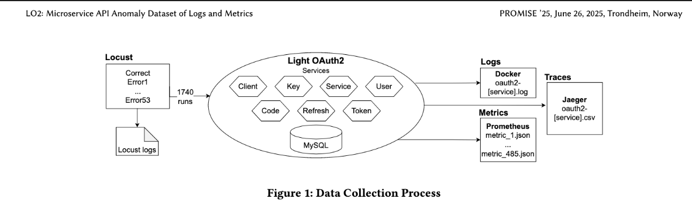

# LO2 Pipeline Architektur – Detaildokumentation

Diese Dokumentation beschreibt die Architektur der LO2-Pipeline im LogLead-Projekt vollständig. Sie richtet sich an alle, die die Machbarkeit erklärbarer Anomalieerkennung für OAuth/OIDC-APIs analysieren oder die Pipeline erweitern möchten.

---
## Inhaltsverzeichnis
1. [Zielsetzung & Scope](#zielsetzung--scope)
2. [Systemkontext & Abhängigkeiten](#systemkontext--abhängigkeiten)
3. [Pipeline-Übersicht](#pipeline-übersicht)
4. [Komponentenbeschreibung](#komponentenbeschreibung)
   - [Loader-Layer](#loader-layer-logleadloaderslo2lo2loader)
   - [Event Enhancement Layer](#event-enhancement-layer)
   - [Sequence Enhancement Layer (optional)](#sequence-enhancement-layer-optional)
   - [Modelling Layer](#modelling-layer-logleadanomaly_detectoranomalydetector)
   - [Explainability Layer](#explainability-layer)
   - [Persistenz & Artefakte](#persistenz--artefakte)
5. [Datenartefakte & Schemas](#datenartefakte--schemas)
6. [Skriptlandschaft & Ausführungsreihenfolge](#skriptlandschaft--ausführungsreihenfolge)
7. [Konfigurationsoberflächen & Parameter](#konfigurationsoberflächen--parameter)
8. [Betrieb & Wiederverwendung](#betrieb--wiederverwendung)
9. [Qualitätssicherung & Tests](#qualitätssicherung--tests)
10. [Bekannte Einschränkungen & Verbesserungsbedarf](#bekannte-einschränkungen--verbesserungsbedarf)

---
## Zielsetzung & Scope
Die LO2-Pipeline bildet die Referenzimplementierung für logbasierte Anomalieerkennung an OAuth/OIDC-Microservices. Sie beantwortet folgende Fragen:
- Wie lassen sich Roh-Logs aus LightOAuth2 (LO2) systematisch laden, normalisieren und persistieren?
- Welche Feature-Repräsentationen liefern sich für Ereignis- und Sequenzebene?
- Wie wird ein Isolation-Forest-Baseline-Modell aufgebaut und bewertet?
- Welche Explainability-Artefakte (Nearest-Neighbour, SHAP) stehen zur Verfügung?
- Wie werden Modelle und Artefakte gespeichert, um Wiederholbarkeit zu garantieren?

Scope: Fokus liegt auf der vollständigen Event-Pipeline (Rohlog → Feature → Modell → Explainability). Themen wie Deployment, UI oder kontinuierliche Integration sind nicht Bestandteil.

---
## Systemkontext & Abhängigkeiten
- **Programmiersprache:** Python 3.10+
- **Kernbibliotheken:** `polars`, `scikit-learn`, `joblib`, `matplotlib`, `shap`
- **Projektstruktur:** Repository `LogLead`, Hauptordner `/Users/MTETTEN/Projects/LogLead`
- **Datengrundlage:** LO2-Sample-Logs (Verzeichnis `<pfad-zum-lo2-sample>`). Ohne diese Logs kann der Loader nicht arbeiten.
- **Virtuelle Umgebung:** empfohlen; muss `loglead` im Entwicklungsmodus enthalten.
- **Hardware:** Standard-Laptop ausreichend; Drain-Parsing und SHAP profitieren von >8 GB RAM.

---
## Pipeline-Übersicht

---
## Komponentenbeschreibung

### Loader-Layer (`loglead.loaders.lo2.LO2Loader`)
**Aufgabe:** Roh-Logs aus dem LightOAuth2-Datensatz einlesen, normalisieren, strukturieren und optional persistieren.

**Einstiegspunkt:** `python demo/run_lo2_loader.py ...`

**wichtige CLI-Argumente:**
- `--root`: Wurzelverzeichnis mit `run_*`-Ordnern.
- `--runs`: Anzahl zu verarbeitender Runs.
- `--errors-per-run`: Anzahl Error-Testcases pro Run (bei `dup_errors=False` versucht der Loader einzigartige Errors zu wählen).
- `--single-service`: Filtert auf einen Service (z.B. `client`, → `oauth2-oauth2-client`).
- `--save-parquet`: Persistiert Ergebnisse unter `--output-dir`.
- `--load-metrics`: Optionales Parsen von Metriken.

**Innere Logik:**
1. Traversiert Run-Ordner, wählt Testcases (`correct` + Fehlerfälle).
2. Liest logfiles pro Service, entfernt Leerzeilen.
3. Erzeugt Polars-DataFrame `df` mit Spalten: `m_message`, `run`, `test_case`, `service`, `seq_id`, später `m_timestamp`, `normal`, `anomaly`.
4. Erstellt Sequenz-DataFrame `df_seq` über Aggregation.
5. Optional `metrics_df` durch Parse von JSON-Metriken.
6. Persistiert (bei `--save-parquet`) nach `demo/result/lo2/`.

**Fehlerfälle & Hinweise:**
- Fehlendes `--save-parquet` verhindert spätere Phasen (kein Events-Parquet).
- Timestamps werden aus dem Log extrahiert (regex), Einträge ohne Zeitstempel fallen weg.
- Bei `single_error_type` erzwingt der Loader widerspruchsfreie Parameter (`dup_errors=True`, `errors_per_run=1`).

### Event Enhancement Layer
**Klasse:** `loglead.enhancers.EventLogEnhancer`

**Aufgabe:** Feature-Spalten auf Event-Ebene anreichern.

**Standard-Pipeline (siehe `demo/LO2_samples.py`):**
1. `normalize()` – Trim, Lowercase-Strategien, Standardisierung von Whitespace.
2. `words()` – Tokenisierung in Wörter (`e_words`, `e_words_len`).
3. `trigrams()` – 3-Character-N-Gramme (`e_trigrams`, `e_trigrams_len`).
4. `parse_drain()` – Drain parser → Template IDs (`e_event_drain_id`). Kann fehlschlagen, wird abgefangen.
5. `length()` – Längenmerkmale (`e_chars_len`, `e_lines_len`).

**Weitere verfügbare Methoden:** `alphanumerics()`, Parser (`parse_spell`, `parse_iplom`, ...), Embeddings (TensorFlow erforderlich).

### Sequence Enhancement Layer (optional)
**Klasse:** `loglead.enhancers.SequenceEnhancer`

**Aufgabe:** Ereignis-Features auf Sequenzebene aggregieren.

**Standard-Schritte (Phase C):**
- `seq_len()` – Anzahl Events pro `seq_id`.
- `duration()` – Dauer zwischen erstem und letztem Timestamp.
- `tokens(token="e_words")` / `tokens(token="e_trigrams")` – Aggregation von Tokenlisten.

**Ergebnis:** Sequenz-DataFrame mit zusätzlichen numerischen Features (z.B. `seq_len`, `duration_sec`). Wird für Sequence-LR und Explainability genutzt.

### Modelling Layer (`loglead.anomaly_detection.AnomalyDetector`)
**Aufgabe:** Modelltraining, Vektorisierung und Vorhersage.

**Kernattribute:**
- `item_list_col` – Spalte mit Tokenlisten oder Strings (für CountVectorizer).
- `numeric_cols` – Liste numerischer Zusatzfeatures.
- `emb_list_col` – optional, Liste von Embeddings.
- `train_df`, `test_df` – Polars DataFrames; werden extern gesetzt.
- `vectorizer` / `vectorizer_no_anos` – CountVectorizer für Tokens.
- `X_train`, `X_test`, `labels_train`, `labels_test` – Sparse-Matrizen.

**Important Methods:**
- `prepare_train_test_data(vectorizer_class=CountVectorizer)` – Fit/Transform Token- und numerische Features. Bei Übergabe eines existierenden Vectorizers (`vectorizer_class=vec`) wird nur transformiert.
- `train_IsolationForest(...)`, `train_LR(...)`, `train_DT()` – Wrapper um Sklearn-Modelle.
- `predict()` – liefert Polars-DataFrame mit `pred_ano`; optional `pred_ano_proba` (bei `auc_roc=True`), druckt Accuracy/F1/Confusion Matrix.

**IF-Spezifika:**
- `filter_anos=True` trennt Trainingsdaten auf Basis `anomaly`-Flag (`train_df` wird vorher auf `test_case == "correct"` gefiltert).
- Scoreable Werte via `sad.model.score_samples(...)` (negiert für Ranking).

**Persistenz:**
- Modelle werden über das CLI-Flag `--save-model <pfad>` persistiert; bei wiederholten Läufen optional `--overwrite-model` setzen.

### Explainability Layer
**Module:** `loglead.explainer.NNExplainer`, `loglead.explainer.ShapExplainer`

**NNExplainer:**
- Input: Polars-DataFrame inkl. `pred_ano`, Feature-Matrix (dense oder sparse), ID-Spalte.
- Ausgabe: Mapping CSV (`if_nn_mapping.csv`) mit Zuordnung Anomalie ↔ nächster Normalfall (Cosine Similarity), optional False-Positive-Textdatei.

**ShapExplainer:**
- Unterstützt LR, LinearSVC, Entscheidungsbäume, RandomForest, IsolationForest, XGBoost.
- Verwendet denselben Vectorizer wie das Modell.
- `calc_shapvalues()` + `plot(plottype="summary")`/`shap.plots.bar` generiert PNGs + Top-Feature-Listen (`*_top_tokens.txt`).
- Ressourcenwarnung bei großen Feature-Mengen (internes Limit ~1.500 Features).

### Persistenz & Artefakte
- **Event-Parquet:** `demo/result/lo2/lo2_events.parquet`
- **Sequenz-Parquet:** `demo/result/lo2/lo2_sequences.parquet`
- **Predictions:** `demo/result/lo2/lo2_if_predictions.parquet` (bzw. `*_new.parquet` für Folgeruns)
- **Modelle:** `LO2_samples.py --save-model` → `models/lo2_if.joblib`
- **Explainability:** `demo/result/lo2/explainability/` (CSV, TXT, PNG, JSON)

---
## Datenartefakte & Schemas

### Event-Level (`lo2_events.parquet`)
| Spalte | Typ | Beschreibung |
| --- | --- | --- |
| `m_message` | Utf8 | Rohlogzeile |
| `run` | Utf8 | Run-ID (z.B. `run_0001`) |
| `test_case` | Utf8 | `correct` oder Fehlername |
| `service` | Utf8 | Servicename (`light-oauth2-oauth2-client-1` ...) |
| `seq_id` | Utf8 | Zusammengesetzt aus Run/Testcase/Service |
| `m_timestamp` | Datetime | aus Log extrahierter Timestamp |
| `normal` | bool | True für `correct` |
| `anomaly` | bool | Invers zu `normal` |
| `e_words` | List[Utf8] | Tokenliste (Words) |
| `e_words_len` | Int | Anzahl Tokens |
| `e_trigrams` | List[Utf8] | 3-Gramm-Liste |
| `e_trigrams_len` | Int | Anzahl 3-Gramme |
| `e_event_drain_id` | Utf8 | Drain-Template-ID |
| `e_chars_len` | Int | Zeichenlänge |
| `e_lines_len` | Int | Zeilenlänge (idR 1) |
| ... | ... | weitere optionale Spalten (Parser, Embeddings) |

### Sequenz-Level (`lo2_sequences.parquet`)
| Spalte | Typ | Beschreibung |
| --- | --- | --- |
| `seq_id` | Utf8 | Identisch zu Event-`seq_id` |
| `m_message` | Utf8 | Konkatinierte Events |
| `normal` | bool | Sequence normal? |
| `anomaly` | bool | Sequence anomal? |
| `start_time` | Datetime | frühester Timestamp |
| `end_time` | Datetime | spätester Timestamp |
| `seq_len` | Int | Anzahl Events (via SequenceEnhancer) |
| `duration_sec` | Float | Dauer in Sekunden |
| `tokens_e_words` | List[List[Utf8]] | Aggregierte Tokens |
| ... | ... | weitere aggregierte Features |

### Predictions (`lo2_if_predictions.parquet`)
| Spalte | Beschreibung |
| --- | --- |
| `pred_ano` | Vorhersage (1=anomal, 0=normal) |
| `score_if` | Anomaliescore (`-score_samples`) |
| `rank_if` | Dichtes Ranking nach Score |
| plus originale Eventspalten (für Kontext) |

---
## Skriptlandschaft & Ausführungsreihenfolge

1. **`demo/run_lo2_loader.py`** – Erstellt Event-/Sequenz-Parquets. Muss zwingend vor allen weiteren Schritten laufen.
2. **`demo/LO2_samples.py`** – Steuert Phasen `enhancers`, `if`, `full`.
   - `--phase enhancers` – beendet nach Feature-Erzeugung.
   - `--phase if` – Isolation Forest, Score-Parquet.
   - `--phase full` – zusätzlich LR, DecisionTree, Sequenz-LR.
3. **`demo/lo2_phase_f_explainability.py`** – Reproduziert bestes IF-Setup, erstellt Explainability.
4. **Spezialskripte:**
   - `demo/unsupervised_models.py` – Batch-Auswertung weiterer Algorithmen.

---
## Konfigurationsoberflächen & Parameter

| Ebene | Parameter | Beschreibung |
| --- | --- | --- |
| Loader (`run_lo2_loader.py`) | `--runs`, `--errors-per-run`, `--single-service`, `--allow-duplicates`, `--single-error-type`, `--save-parquet`, `--output-dir`, `--load-metrics` | Datenmenge und Persistenz |
| Enhancer (`LO2_samples.py`) | implizit durch Code; Reihenfolge anpassbar | Hinzufügen/Entfernen von Feature-Schritten |
| Isolation Forest (`LO2_samples.py`) | `--if-contamination`, `--if-n-estimators`, `--if-max-samples`, `--if-item`, `--if-numeric` | Steuerung der IF-Hyperparameter |
| Explainability (`lo2_phase_f_explainability.py`) | `--if-*` (wie oben), `--shap-sample`, `--nn-top-k`, `--nn-normal-sample` | Sampling für XAI-Artefakte |
| `AnomalyDetector` API | `item_list_col`, `numeric_cols`, `emb_list_col`, `filter_anos`, `print_scores`, `auc_roc` | Programmgesteuerte Nutzung |

---
## Betrieb & Wiederverwendung

   1. **Persistenz aktivieren:** `run_lo2_loader.py` mit `--save-parquet`, Modelle via `LO2_samples.py --save-model <pfad>` sichern.
2. **Restart-Fall:** Parquets mit `pl.read_parquet(...)` laden, `joblib.load(...)` für Model + Vectorizer, `AnomalyDetector` initialisieren, `prepare_train_test_data(vectorizer_class=vec)` aufrufen, `sad.model = model`, `sad.predict()`.
3. **Artefakte katalogisieren:**
   - `demo/result/lo2/` enthält alle Parquets.
   - `demo/result/lo2/explainability/` hält XAI-Assets.
   - `models/` sammelt joblib-Dumps.
4. **Versionierung:** Parameter und Ergebnisse in `docs/LO2_e2e_pipeline.md` oder `summary-result.md` protokollieren.

---
## Qualitätssicherung & Tests
- **Manuelle Checks:**
  - Loader-Ausgabe (`Rows`, `Services`, `Test cases`).
  - Top-5 Scores nach IF (`rank_if`).
  - Vergleich der Kennzahlen (Accuracy, F1, AUCROC) zwischen Läufen.
- **Automatisierte Skripte:** `tests/enhancers.py`, `tests/anomaly_detectors.py` (generisch, nicht LO2-spezifisch).
- **Data Sampling:** Parameter `--runs`, `--errors-per-run` erlauben schnelle Smoke Tests.
- **Explainability-Prüfung:** `if_nn_mapping.csv` auf korrekte Zuordnung kontrollieren, SHAP-Plots auf Top-Features (Token-Liste) prüfen.

---
## Bekannte Einschränkungen & Verbesserungsbedarf
1. **False-Positive-Hotspot:** Service `light-oauth2-oauth2-client-1` dominiert Top-Ränge. Lösungsideen: Service-Filter in `train_df`, zusätzliche Features (`seq_len`, `duration_sec`, `unique_tokens`).
2. **Drain-Abhängigkeit:** `parse_drain()` kann bei fehlenden Templates scheitern; try/except blendet Fehler aus. Für reproduzierbare Ergebnisse mit Logging ergänzen.
3. **Persistenz-Automatisierung:** joblib-Dumps erfolgen nicht automatisch; ein CLI-Flag in `LO2_samples.py` könnte das nachrüsten.
4. **Explainability-Ressourcen:** SHAP kann bei großen Vokabularen speicherintensiv werden; `--shap-sample` bewusst wählen.
5. **Metrics-Join:** Aggregierte Experimente berücksichtigen `lo2_metrics.parquet` bislang kaum; ein optionaler Join in `LO2_samples.py` steht noch aus.
6. **Dokumentation:** Ergebnisse und Parameter werden manuell in Markdown gepflegt; eine automatische Laufhistorie wäre wünschenswert.

---
Dieses Dokument bildet die Basis für den schriftlichen Teil der Bachelorarbeit. Es stellt sicher, dass alle technischen Details der Pipeline transparent sind und Anknüpfungspunkte für Analyse, Bewertung und Erweiterungen klar dokumentiert sind.
