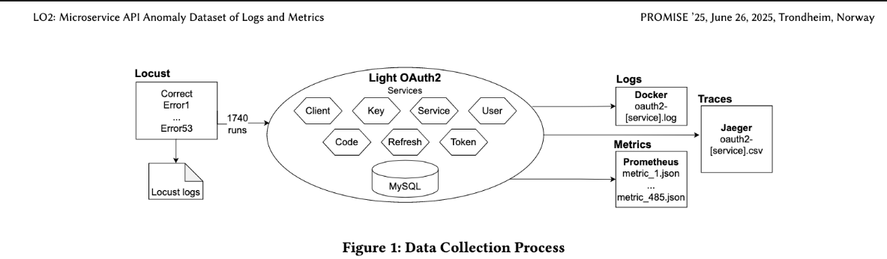

# LO2 Datensatz - README

## Light OAuth2:

## Kurzueberblick
- **LO2** kombiniert Logs, Metriken und Traces des Microservice-Stacks *Light-OAuth2*, um negative Testszenarien reproduzierbar zu analysieren (Bakhtin et al., 2025, S. 2 f.).
- **Fokus**: Ich nutze ausschliesslich die **Service-Logs der Services `token`, `code` und `refresh-token`** - sie bilden den Laufzeitpfad des Authorization-Code-Flows (+/-PKCE) sowie den Refresh-Token-Flow ab (Bakhtin et al., 2025, S. 3 f., 6).
- **Label-Logik**: Pro API-Operation existiert genau *ein* korrektes Szenario und *mehrere* gezielt provozierte Fehler (`correct` vs. `errorX`), damit Modelle zwischen Normal- und Fehlerverhalten unterscheiden koennen (Bakhtin et al., 2025, S. 4).

## Quellen & Links
- **Datensatz (Zenodo)**: https://zenodo.org/records/14938118  
- **Paper**: https://dl.acm.org/doi/pdf/10.1145/3727582.3728682
- **Light-OAuth2 Architektur**: https://github.com/networknt/light-oauth2 (archiviert)

## Warum nur Service-Logs?
- Das Paper belegt, dass **Client- und Token-Service-Logs die hoechste Anomalieaufloesung liefern**, waehrend Key-Logs kaum beitragen (Bakhtin et al., 2025, S. 5 f.).
- Der **Token-Service** ist der beste Praediktor, weil er am Ende jedes OAuth-Flows steht; Fehler in frueheren Schritten fuehren zu wenigen erfolgreichen Token-Aufrufen (Bakhtin et al., 2025, S. 6).
- Fuer unseren TokenMaster-Fokus reichen daher die Laufzeit-Logs der Sequenz `code -> token -> refresh`. Metriken und Traces sind zwar Teil des Datensatzes, werden hier aber **nicht** verarbeitet.

## Relevanz fuer den LO2 End-to-End Flow
1. **Ingestion**: Service-Logs werden pro Run/Test/Service abgelegt (`run_<id>/<test_label>/<service>/oauth2-*.log`).
2. **Preprocessing**: Wir reduzieren Initialisierungssequenzen (`reduce_logs.py`) und parsen Logzeilen zu Event-IDs (z. B. Drain3).
3. **Labeling**: `correct` vs. spezifisches `errorX` (z. B. falscher `grant_type`, fehlende `redirect_uri`) bilden Zielklassen.
4. **Feature Engineering**: Event-Haeufigkeiten, Sequenzlaengen oder n-Grams je Service; Aufteilung getrennt nach `code`, `token`, `refresh`.
5. **Modelle**: LogLead-Modelle (DecisionTree, LogisticRegression, IsolationForest, KMeans, RarityModel, OOVD) arbeiten auf den geparsten Event-IDs (Bakhtin et al., 2025, S. 5).
6. **Evaluation & Feedback**: Ergebnisse gehen in TokenMaster-Hypothesen und Monitoring-Alerts ein.

## Testsetup - Tokenzentrierte Sicht
- **Abgedeckte Flows**: Authorization Code (+/-PKCE), Client Credentials, Refresh Token sowie CRUD auf Client/User/Service (Bakhtin et al., 2025, S. 3).
- **Durchfuehrung**: Locust orchestriert 54 Tests pro Run - 1x nur korrekte Tasks, 53x korrekt + genau ein Fehler (Bakhtin et al., 2025, S. 3 f.).
- **Zeitliche Struktur**: 60 s korrekt, anschliessend 10 s korrekt+Fehler; so entstehen pro Fehlerklasse saubere Kontraste.
- **Sampling in unserem Projekt**: Fuer jede betrachtete Fehlerklasse waehlen wir `1x correct` und `1x errorN` Ordner, jeweils mit drei Logs (`oauth2-code.log`, `oauth2-token.log`, `oauth2-refresh.log`).

## Ordnerlogik & Dateitypen
- **Run-Ebene**: `run_<id>` repraesentiert eine komplette Test-Suite (1740 Runs, unkomprimiert ~ 540 GB; Bakhtin et al., 2025, S. 4).
- **Test-Ebene**: `correct`, `error1`, ... `error53` - jeder Fehler steht fuer eine konkrete Verletzung der OAuth-Spezifikation.
- **Service-Ebene**: Wir lesen ausschliesslich die Logs aus `code`, `token` und `refresh-token`. Andere Services (z. B. `client`, `key`) bleiben aussen vor.
- **Dateitypen**:
  - `.log` - Container-Logs, via `docker logs` pro Service abgegriffen (Bakhtin et al., 2025, S. 4).
  - `.log` (Locust) - Metadaten zu fehlerausloesenden Requests; dienen als Ground Truth (Bakhtin et al., 2025, S. 4).
  - `.json` / `.csv` - Metriken und Traces, stehen bereit, bleiben jedoch in diesem Setup ungenutzt (Traces enthalten meist nur einen Span; Bakhtin et al., 2025, S. 4).

## Diagramm - Von LO2-Logs zu TokenMaster-Erkenntnissen

## Fehlerklassen & typische Signaturen
- **Authorization Code Fehler** (`errorX`): z. B. fehlende `redirect_uri`, ungueltiger `response_type` -> auffaellige Warnungen im `code`-Service.
- **Token Fehler**: falsches Client-Secret, inkonsistenter `grant_type`, abgelaufener Code -> 401/invalid_grant im `token`-Log.
- **Refresh Fehler**: abgelaufene oder widerrufene Refresh Tokens -> `invalid_token` im `refresh-token`-Log, seltene erfolgreiche Verlaengerungen.
- **Client Credentials**: Weniger sequenziell, liefern aber zusaetzliche Negativbeispiele im `token`-Log.

## Hinweise zur Nutzung
- **Parsing**: Rohe Logzeilen mit Drain3 o. Ae. zu Event-IDs normalisieren -> `timestamp, service, event_id, label`.
- **Splits**: Service-spezifische Trainingssets erzeugen; Single-Service-Modelle erreichen bessere Ergebnisse als Service-Konkatenation (Bakhtin et al., 2025, S. 5).
- **Explainability**: Interpretable Modelle + SHAP/LIME erlauben Rueckschluss auf kritische Events.
- **Traces & Metriken**: Koennen fuer Zeitreihenanalysen ergaenzt werden; aktuelle LO2-Version enthaelt pro Trace maximal einen Span (Bakhtin et al., 2025, S. 4, 6).

## Referenzen
- Bakhtin, V. et al. (2025): *LO2: Multi-modal Dataset for Log Anomaly Detection in Microservice Systems*. In: Proceedings of the 2025 ACM/SPEC ICPE. https://dl.acm.org/doi/pdf/10.1145/3727582.3728682
- Zenodo-Releases: *LO2 Dataset (Data + Sample)*. https://zenodo.org/records/14938118
- Light-OAuth2 Projekt (archiviert): https://github.com/networknt/light-oauth2
