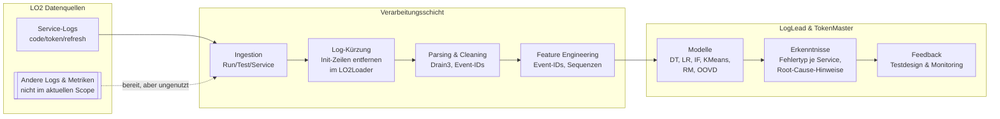

# LO2 Datensatz - README

## Light OAuth2:

## Kurzueberblick
- **LO2** kombiniert Logs, Metriken und Traces des Microservice-Stacks *Light-OAuth2*, um negative Testszenarien reproduzierbar zu analysieren (Bakhtin et al., 2025, S. 2 f.).
- **Fokus**: Ich nutze ausschliesslich die **Service-Logs der Services `token`, `code` und `refresh-token`** - sie bilden den Laufzeitpfad des Authorization-Code-Flows (+/-PKCE) sowie den Refresh-Token-Flow ab (Bakhtin et al., 2025, S. 3 f., 6).
- **Label-Logik**: Pro API-Operation existiert genau *ein* korrektes Szenario und *mehrere* gezielt provozierte Fehler (`correct` vs. `errorX`), damit Modelle zwischen Normal- und Fehlerverhalten unterscheiden koennen (Bakhtin et al., 2025, S. 4).

## Quellen & Links
- **Datensatz (Zenodo)**: https://zenodo.org/records/14938118  
- **Paper**: https://dl.acm.org/doi/pdf/10.1145/3727582.3728682
- **Light-OAuth2 Architektur**: https://github.com/networknt/light-oauth2 (archiviert)

## Warum nur diese 3 Service-Logs? (code, token, refresh-token)

### Empirische Begründung aus dem LO2-Paper
Das Paper belegt, dass **Client- und Token-Service-Logs die höchste Anomalieauflösung liefern**, während Key-Logs kaum beitragen (Bakhtin et al., 2025, S. 5 f.). Der **Token-Service** ist der beste Prädiktor, weil er am Ende jedes OAuth-Flows steht; Fehler in früheren Schritten führen zu wenigen erfolgreichen Token-Aufrufen (Bakhtin et al., 2025, S. 6).

### Architektur-Grundlage (Light-OAuth2)
Light-OAuth2 besteht laut Dokumentation aus **7 Microservices**: `client`, `code`, `key`, `refresh-token`, `service`, `token`, `user`. Die Architektur unterscheidet:
- **Runtime-Services**: `code`, `token`, `key` (+ optional `provider`) - "will be accessed from clients during the runtime"
- **Configuration-Services**: `user`, `client`, `service` - "connected ... to make configuration changes"

**Wichtig**: Die Light-OAuth2-Dokumentation spezifiziert nicht explizit, welcher Service bei Refresh-Token-Renewal involviert ist oder ob alle Laufzeit-Flows ausschließlich über diese drei Logs laufen. Die folgende Zuordnung ist daher **inferiert** aus Architekturlogik, OAuth 2.0-Spezifikation und empirischer Analyse des LO2-Datensatzes.

### Service-zu-Flow-Mapping: Welche Logs gehören zu welchem Flow?

Light-OAuth2 besteht aus 7 Services, aber **nicht alle sind für Laufzeit-Authentifizierung relevant**:

| Flow | Primäre Endpoints | Service-Logs die du brauchst | Was du darin siehst |
|------|-------------------|------------------------------|---------------------|
| **Authorization Code** | `GET /oauth2/code` → `POST /oauth2/token` | `code` → `token` | Im `code`-Log die Autorisierung/Weiterleitung mit Code; im `token`-Log der Code-Tausch auf Access/Refresh Token |
| **Authorization Code + PKCE** | wie oben + `code_challenge`/`code_verifier` | `code` → `token` | PKCE wird beim Token-Tausch validiert, deshalb PKCE-Fehler im `token`-Service (nicht `code`) |
| **Client Credentials** | `POST /oauth2/token` mit `grant_type=client_credentials` | nur `token` | Nur der `token`-Service im Spiel; keine `code`/`user`-Logs |
| **Refresh Token (Renewal)** | `POST /oauth2/token` mit `grant_type=refresh_token` | nur `token` | Die Erneuerung läuft über den Token-Endpoint, **nicht** über den refresh-token-Service |

**Wichtige Nuance: Refresh vs. refresh-token-Service** (inferiert, nicht explizit dokumentiert)
- **Token-Renewal** (Access Token erneuern): Laut OAuth 2.0-Spec erfolgt dies am Token-Endpoint (`POST /oauth2/token` mit `grant_type=refresh_token`) → siehe `token`-Log
- **Refresh-Token-Verwaltung** (listen/revoke/info): Admin/Management-Operationen für bestehende RTs → siehe `refresh-token`-Log
- **Konsequenz**: Fehler wie „abgelaufener RT", „RT schon benutzt", „invalid_grant" sollten primär im `token`-Log erscheinen
- **Hinweis**: Dies ist aus der OAuth-Spezifikation abgeleitet; Light-OAuth2-Docs spezifizieren die Refresh-Renewal-Zuständigkeit nicht explizit

### Ausgeschlossene Services und warum

| Service | Zweck | Warum nicht im Scope |
|---------|-------|----------------------|
| `client` | `/oauth2/client/*` - Client CRUD | Onboarding/Governance, kein Laufzeit-Auth-Flow |
| `user` | `/oauth2/user/*` - User CRUD | Benutzerverwaltung, außerhalb der Laufzeitflüsse |
| `service` | `/oauth2/service/*` - Service-Onboarding | Meta-Konfiguration, kein Laufzeit-Flow |
| `key` | `/oauth2/key/*` - JWT-Key Distribution | Wird von den vier Flows passiv genutzt, liefert laut Paper kaum Anomalie-Signal |

**CRUD ≠ Laufzeit-Auth**: Light-OAuth2-Docs bezeichnen `client`, `user`, `service` als Configuration-Services. Sie sind für Governance/Onboarding relevant, aber nicht Teil der Runtime-Authentifizierung.

### Was wir mit `code` + `token` + `refresh-token` abdecken (Hypothese)

Die folgende Abdeckung ist **aus OAuth 2.0-Spezifikation und Architekturlogik inferiert**, nicht explizit in Light-OAuth2-Docs bestätigt:

✅ **Authorization Code Flows (±PKCE)**: Vollständig (code → token)  
✅ **Client Credentials**: Vollständig (nur token)  
✅ **Refresh Token Renewals**: Sollte vollständig sein (token-Endpoint gemäß OAuth 2.0)  
✅ **Refresh-Token-Verwaltung**: Vollständig (refresh-token für Admin-Ops)  

❌ **CRUD-Analysen**: Bräuchten zusätzlich client/user/service-Logs

**Validierung**: Diese Hypothese wird durch die empirischen Ergebnisse des LO2-Papers gestützt (Token-Service als bester Prädiktor) und kann durch Analyse der Logdaten verifiziert werden.

### Praxis-Mapping auf Dateinamen (pro Test-Case-Ordner)

```
run_XXXX/correct/
├── oauth2-code.log           # Authorization-Code-Anfragen
├── oauth2-token.log          # Token-Tausch (alle grant_types)
└── oauth2-refresh-token.log  # Refresh-Token-Management
```

**Für TokenMaster-Fokus sollten diese drei Logs ausreichen**, um alle Standard-OAuth-Flows und deren Fehlerszenarien abzudecken. Diese Annahme basiert auf:
1. **Light-OAuth2-Architektur**: Runtime-Services vs. Configuration-Services
2. **OAuth 2.0-Spezifikation**: Token-Endpoint bedient alle Standard-Grants
3. **LO2-Paper**: Token-Service als bester Prädiktor empirisch bestätigt

**Einschränkung**: Die vollständige Abdeckung ist nicht durch Light-OAuth2-Docs garantiert und sollte durch empirische Log-Analyse verifiziert werden.

Metriken und Traces sind zwar Teil des Datensatzes, werden hier aber **nicht** verarbeitet.

## Relevanz fuer den LO2 End-to-End Flow
1. **Ingestion**: Service-Logs werden pro Run/Test/Service abgelegt (`run_<id>/<test_label>/<service>/oauth2-*.log`).
2. **Preprocessing**: Wir entfernen Initialisierungszeilen (im LO2Loader) und parsen Logzeilen zu Event-IDs (z. B. Drain3).
3. **Labeling**: `correct` vs. spezifisches `errorX` (z. B. falscher `grant_type`, fehlende `redirect_uri`) bilden Zielklassen.
4. **Feature Engineering**: Event-Haeufigkeiten, Sequenzlaengen oder n-Grams je Service; Aufteilung getrennt nach `code`, `token`, `refresh`.
5. **Modelle**: LogLead-Modelle (DecisionTree, LogisticRegression, IsolationForest, KMeans, RarityModel, OOVD) arbeiten auf den geparsten Event-IDs (Bakhtin et al., 2025, S. 5).
6. **Evaluation & Feedback**: Ergebnisse gehen in TokenMaster-Hypothesen und Monitoring-Alerts ein.

## Was ist ein "Run"? - Aufbau des LO2-Datensatzes

Ein **Run** ist ein kompletter Testdurchlauf des Light-OAuth2-Systems mit systematischer Fehler-Injektion. Die Autoren definieren den Ablauf wie folgt:

### Ablauf eines einzelnen Runs

1. **System-Deployment**
   - Docker-Compose des Light-OAuth2-Stacks hochfahren
   - Warten bis alle Services bereit sind

2. **Baseline-Phase: "correct"**
   - **Dauer**: 60 Sekunden
   - **Tasks**: Nur korrekte OAuth-Operationen (Authorization Code Flow, Refresh Token, etc.)
   - **Zweck**: Normale Systemlast und fehlerfreies Verhalten etablieren
   - **Datensammlung**: Logs, Metriken, Traces für den `correct`-Test-Case

3. **Fehler-Injektions-Phasen: "error1" bis "error53"**
   - **Pro Fehlertyp**: Eine separate Test-Phase
   - **Dauer je Phase**: 10 Sekunden korrekt + 10 Sekunden korrekt+Fehler
   - **Ablauf**:
     - Zuerst 10 s normale Tasks (um System in stabilem Zustand zu halten)
     - Dann wird **genau ein spezifischer Fehler** injiziert (z.B. `error3: fehlende redirect_uri`)
     - Parallel laufen weiterhin korrekte Tasks
   - **Datensammlung**: Nach jeder Fehler-Phase werden Logs/Metriken/Traces gezogen
   - **Isolation**: Jeder Fehlertyp wird in eigenem Test-Case-Ordner gespeichert

4. **System-Abbau**
   - Docker-Compose stoppen
   - Run abgeschlossen

### Struktur im Dateisystem

```
run_0001/                          # Ein kompletter Run
├── correct/                       # 60s nur korrekte Tasks
│   ├── oauth2-code.log
│   ├── oauth2-token.log
│   ├── oauth2-refresh-token.log
│   └── metrics/
├── error1/                        # 10s korrekt + error1
│   ├── oauth2-code.log
│   ├── oauth2-token.log
│   └── ...
├── error2/                        # 10s korrekt + error2
│   └── ...
...
└── error53/                       # 10s korrekt + error53
    └── ...

run_0002/                          # Nächster Run, gleiche Struktur
├── correct/
├── error1/
...
```

### Datensatz-Umfang
- **1740 Runs** insgesamt im vollständigen Datensatz
- **54 Test-Cases pro Run**: 1 × `correct` + 53 × `errorX`
- **Unkomprimiert**: ~540 GB (Bakhtin et al., 2025, S. 4)
- **Reproduzierbarkeit**: Jeder Run liefert identische Fehler-Sequenz

## Testsetup - Tokenzentrierte Sicht
- **Abgedeckte Flows**: Authorization Code (+/-PKCE), Client Credentials, Refresh Token sowie CRUD auf Client/User/Service (Bakhtin et al., 2025, S. 3).
- **Locust-Orchestrierung**: 54 Tests pro Run mit systematischer Fehler-Injektion (siehe oben)
- **Zeitliche Struktur**: 60 s Baseline (`correct`), dann 53× jeweils 10 s mit genau einem Fehlertyp
- **Kontrast-Erzeugung**: Durch separate Test-Cases entstehen saubere Vergleiche zwischen Normal- und Fehlerverhalten
- **Sampling in unserem Projekt**: Für jede betrachtete Fehlerklasse wählen wir `1x correct` und `1x errorN` Ordner, jeweils mit drei Logs (`oauth2-code.log`, `oauth2-token.log`, `oauth2-refresh.log`).

## Ordnerlogik & Dateitypen
- **Run-Ebene**: `run_<id>` repraesentiert eine komplette Test-Suite (1740 Runs, unkomprimiert ~ 540 GB; Bakhtin et al., 2025, S. 4).
- **Test-Ebene**: `correct`, `error1`, ... `error53` - jeder Fehler steht fuer eine konkrete Verletzung der OAuth-Spezifikation.
- **Service-Ebene**: Wir lesen ausschliesslich die Logs aus `code`, `token` und `refresh-token`. Andere Services (z. B. `client`, `key`) bleiben aussen vor.
- **Dateitypen**:
  - `.log` - Container-Logs, via `docker logs` pro Service abgegriffen (Bakhtin et al., 2025, S. 4).
  - `.log` (Locust) - Metadaten zu fehlerausloesenden Requests; dienen als Ground Truth (Bakhtin et al., 2025, S. 4).
  - `.json` / `.csv` - Metriken und Traces, stehen bereit, bleiben jedoch in diesem Setup ungenutzt (Traces enthalten meist nur einen Span; Bakhtin et al., 2025, S. 4).

## Diagramm - Von LO2-Logs zu TokenMaster-Erkenntnissen



## Fehlerklassen & typische Signaturen (erwartete Log-Verteilung)

Die folgende Zuordnung ist aus OAuth-Spezifikation und Architekturlogik abgeleitet:

- **Authorization Code Fehler** (`errorX`): z. B. fehlende `redirect_uri`, ungültiger `response_type` → erwartete Signaturen im `code`-Service
- **Token Fehler**: falsches Client-Secret, inkonsistenter `grant_type`, abgelaufener Code → erwartete Fehler (401/invalid_grant) im `token`-Log
- **Refresh Fehler**: abgelaufene oder widerrufene Refresh Tokens → sollten primär im `token`-Log erscheinen (Renewal), `refresh-token`-Log für Admin-Ops (revoke/list)
- **Client Credentials**: Direkter Token-Request → erwartete Signaturen nur im `token`-Log

**Hinweis**: Diese Verteilung muss durch empirische Log-Analyse im LO2-Datensatz verifiziert werden.

## Datenkürzung & Vermeidung von Label Leakage
**Kritisch für faire Analyse**: Die originalen Logdateien enthalten Initialisierungssequenzen, die Informationen zur Korrektheit leaken (Bakhtin et al., 2025). Ohne Kürzung würden Modelle diese „Init-Signaturen" als Label-Proxy nutzen und unrealistisch hohe Scores erzielen.

### Implementierung im LO2Loader
**Rohdaten bleiben immutable**: Die Kürzlogik ist direkt in `loglead/loaders/lo2.py` integriert und wird beim Laden angewendet. Originaldateien werden niemals modifiziert.

**Initialisierungszeilen entfernen** (Standard: erste 100 Zeilen):
- Gilt für alle Test-Cases (correct & errorX)
- Parameter: `trim_init_lines=True`, `init_lines_to_skip=100`
- Begründung: Init-Sequenzen korrelieren systematisch mit Labels und führen zu geschönten Scores

**Beispiel-Nutzung**:
```python
from loglead.loaders import LO2Loader

# Standard (Kürzung aktiv, empfohlen)
loader = LO2Loader(
    filename="/path/to/lo2_data",
    n_runs=5,
    service_types=["token", "code", "refresh-token"],
    trim_init_lines=True,      # Standard: erste 100 Zeilen überspringen
    init_lines_to_skip=100     # Anzahl der zu entfernenden Init-Zeilen
)

# Ohne Kürzung (nur zu Testzwecken)
loader_raw = LO2Loader(
    filename="/path/to/lo2_data",
    trim_init_lines=False
)
```

### Referenz-Skript
Das ursprüngliche Zenodo-Replikationspaket enthält `reduce_logs.py` für in-place-Modifikation. Wir verwenden die gleiche Logik (Entfernung der ersten 100 Zeilen), implementieren sie aber non-destruktiv im Loader, um Reproduzierbarkeit und Datenintegrität zu gewährleisten.

## Hinweise zur Nutzung
- **Parsing**: Rohe Logzeilen mit Drain3 o. Ae. zu Event-IDs normalisieren -> `timestamp, service, event_id, label`.
- **Splits**: Service-spezifische Trainingssets erzeugen; Single-Service-Modelle erreichen bessere Ergebnisse als Service-Konkatenation (Bakhtin et al., 2025, S. 5).
- **Explainability**: Interpretable Modelle + SHAP/LIME erlauben Rueckschluss auf kritische Events.
- **Traces & Metriken**: Koennen fuer Zeitreihenanalysen ergaenzt werden; aktuelle LO2-Version enthaelt pro Trace maximal einen Span (Bakhtin et al., 2025, S. 4, 6).

## Datensatz-Eigenschaften & Einschränkungen

### Lizenz & FAIR-Prinzipien
- **Lizenz**: CC BY 4.0 (Creative Commons Attribution 4.0 International)
- **DOI**: https://doi.org/10.5281/zenodo.14938118
- **FAIR**: Dataset erfüllt Findability, Accessibility, Interoperability, Reusability

### Testdesign & Sampling
- **Task-Gewichtung**: Equal spawn rate für korrekte und fehlerhafte Tasks in Locust (Bakhtin et al., 2025, S. 3)
- **Zukünftige Anpassungen**: Gewichtung kann in künftigen Versionen variiert werden
- **Keine Hardware-Faults**: Fokus ausschließlich auf erroneous API usage; keine CPU-, Netz- oder IO-Fault-Injection (Bakhtin et al., 2025, S. 6)

### Tracing-Limitierungen
- **Single-Span-Problem**: Die meisten Traces enthalten nur einen einzelnen Span (Bakhtin et al., 2025, S. 4, 6)
- **Dominierendes Backend**: Häufig nur MySQL-Interaktionen erfasst
- **Leere CSVs**: Viele Trace-Dateien enthalten keine verwertbaren Daten
- **Nicht analysiert**: Im Paper werden Traces deshalb nicht für End-to-End-Analysen verwendet
- **Potenzial**: Bei verbesserter Instrumentierung könnten Traces für latenzbasierte Anomalieerkennung nützlich werden

### Metriken-Verfügbarkeit
- **Vorhanden**: Node-Metriken (CPU load, memory, etc.) in JSON-Format
- **Aktueller Status**: Im LO2Loader implementiert (`load_metrics()`), aber kaum genutzt
- **Mögliche Erweiterung**: Zeitreihenanalysen mit node_load1, memory_usage etc.

## Referenzen
- Bakhtin, V. et al. (2025): *LO2: Multi-modal Dataset for Log Anomaly Detection in Microservice Systems*. In: Proceedings of the 2025 ACM/SPEC International Conference on Performance Engineering (ICPE '25). https://dl.acm.org/doi/10.1145/3727582.3728682
- Bakhtin, V. et al. (2025): *LO2 Dataset (Data + Sample)*. Zenodo. https://doi.org/10.5281/zenodo.14938118
- Bakhtin, V. et al. (2025): *LO2: Multi-modal Dataset for Log Anomaly Detection in Microservice Systems*. arXiv preprint. https://arxiv.org/abs/2501.05111
- Light-OAuth2 Projekt (archiviert): https://github.com/networknt/light-oauth2
