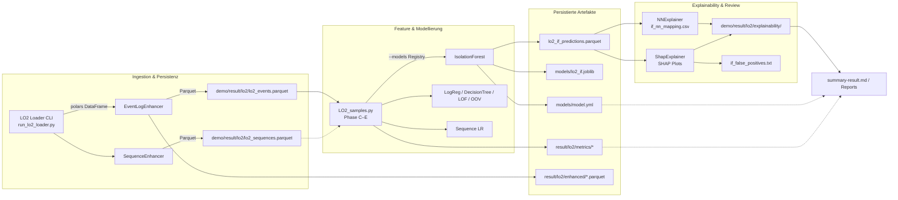

# LogLead LO2 Architektur – High-Level (Mermaid)

```mermaid
graph LR
    subgraph "Ingestion & Persistenz"
        A[LO2 Loader CLI\nrun_lo2_loader.py] -->|polars DataFrame| B[EventLogEnhancer]
        A --> B2[SequenceEnhancer]
        B -->|Parquet| C[demo/result/lo2/lo2_events.parquet]
        B2 -->|Parquet| D[demo/result/lo2/lo2_sequences.parquet]
    end

    subgraph "Feature & Modellierung"
        C --> E[LO2_samples.py\nPhase C–E]
        D -.-> E
        E -->|--models Registry| F1[IsolationForest]
        E --> F2[LogReg / DecisionTree / LOF / OOV]
        E --> F3[Sequence LR]
    end

    subgraph "Persistierte Artefakte"
        F1 --> G1[lo2_if_predictions.parquet]
        F1 --> G2[models/lo2_if.joblib]
        F1 --> G3[models/model.yml]
        E --> G4[result/lo2/metrics/*]
        B --> G5[result/lo2/enhanced/*.parquet]
    end

    subgraph "Explainability & Review"
        G1 --> H1[NNExplainer\nif_nn_mapping.csv]
        G1 --> H2[ShapExplainer\nSHAP Plots]
        H1 --> I[demo/result/lo2/explainability/]
        H2 --> I
        H2 --> H3[if_false_positives.txt]
    end

    I --> J[summary-result.md / Reports]
    G3 -.-> J
    G4 -.-> J
```
