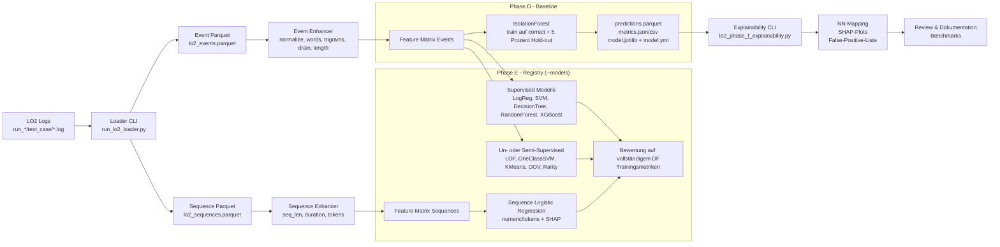

# LO2 Pipeline – Kurzüberblick für Review

Dieses Paper soll in wenigen Minuten zeigen, was aktuell funktioniert, was hinzugefügt wurde und wo noch Lücken liegen. Es fasst den LO2-Demo-Flow bewusst einfacher zusammen als die ausführliche `LO2_architektur_detail.md`.

## 1. Ausgangslage & neue Bausteine

| Baustein | Status | Rolle |
| --- | --- | --- |
| LO2 Loader (`demo/lo2_e2e/run_lo2_loader.py`) | vorhanden, Pfade vereinheitlicht | Liest Roh-Logs, schreibt `lo2_events.parquet` & `lo2_sequences.parquet` |
| Feature Scripts (`EventLogEnhancer`, `SequenceEnhancer`) | vorhanden | Normalisierung, Tokenisierung, Drain IDs, Längen |
| `LO2_samples.py` | erweitert | Ergänzt Persistenz (`--save-model`, `--save-if`), Metrics (`--report-*`), Hold-out (`--if-holdout-fraction`), Thresholding, Metadata-Dump und CLI-Registry-Schalter über dem bestehenden Demo-Skript |
| Explainability (`lo2_phase_f_explainability.py`) | angepasst | Bestehende Klassen (`NNExplainer`, `ShapExplainer`) wurden in ein reproduzierbares CLI-Skript gegossen (Sampling-Flags, Output-Verzeichnis, automatischer IF-Rebuild) |
| Modell-Registry (`--models`, `--list-models`) | neu | Schaltet LogLead-Modelle konfigurierbar zu/ab, bündelt die vorher verteilten Demo-Skripte |
| Benchmark-Artefakte | neu | Parquet, Metrics-JSON/CSV, joblib-Dumps, model.yml |

## 2. Grober Pipeline-Flow

**Lesart:** Der IsolationForest läuft immer (Phase D). Die Registry-Modelle werden zusätzlich je nach `--models` trainiert. Explainability wertet aktuell den IF (und Sequenz-LR-SHAP) aus.

### Event vs. Sequence – Unterschied

- **Event-Level** (`lo2_events.parquet`): Einzelne Log-Zeilen (~100.000+ Zeilen)
  - Jede Zeile = ein Log-Eintrag (z.B. „Token validated", „Error: invalid_token")
  - Features: normalisierte Messages, Drain-Templates, Trigrams, Längen
  - Modelle: IsolationForest, LogReg, SVM, Random Forest etc.
  
- **Sequence-Level** (`lo2_sequences.parquet`): Aggregierte Runs (~1.200–6.000 Sequenzen)
  - Eine Sequence = alle Logs eines Service in einem Test-Case eines Runs
  - `seq_id = run__test_case__service` (z.B. `run_1__correct__oauth2-oauth2-token`)
  - Bei 200 Runs × 2 Test-Cases × 3 Services = **1.200 Sequences**
  - Features: Sequence-Länge, Dauer, Token-Häufigkeiten
  - Modelle: Sequence Logistic Regression + SHAP für Run-Level-Erklärungen

**Warum beide Ebenen?** Event-Modelle erkennen einzelne anomale Log-Zeilen. Sequence-Modelle bewerten das **Gesamtmuster eines Durchlaufs** und erlauben Aussagen wie „Run X war anomal, weil Token Y zu häufig/selten vorkam".

## 3. Welche Daten entstehen?
- `demo/result/lo2/lo2_events.parquet` / `lo2_sequences.parquet` – Loader-Output  
- `demo/result/lo2/benchmarks/if_*.parquet|metrics` – Ergebnisse pro Benchmark-Run (über CLI-Pfad gesteuert)  
- `demo/result/lo2/models/*.joblib` + `model.yml` – persistierte IsolationForest-Modelle inkl. Metadaten  
- `demo/result/lo2/explainability/` – SHAP-Plots, NN-Mapping, False-Positive-Texte  
- Konsolen-Confusion-Matrices – zeigen Trainingsscores der Registry-Modelle (siehe Hinweis unten)

## 4. Modellkatalog (LogLead-Demos)

| Kategorie | Modelle | Kommentar |
| --- | --- | --- |
| Baseline (Phase D) | IsolationForest | Unüberwacht, verwendet Hold-out + Threshold, liefert die robustesten legitimationsfähigen Zahlen. |
| Supervised (Phase E) | `event_lr_words`, `event_lsvm_words`, `event_dt_trigrams`, `event_rf_words`, `event_xgb_words` | Nutzen Labels, erreichen 100 % Accuracy ohne Test-Split (Trainingsdaten = Testdaten). Für faire Benchmarks muss ein Split nachgerüstet werden. |
| Un-/Semi-Supervised | `event_lof_words`, `event_oneclass_svm_words`, `event_kmeans_words`, `event_rarity_words`, `event_oov_words` | Lernen nur auf `correct` Events, liefern alternative Outlier-Definitionen; eignen sich als Ergänzung zum IF. |
| Sequence-Level | `sequence_lr_numeric`, `sequence_lr_words`, `sequence_shap_lr_words` | Arbeiten auf Run-Aggregaten; die SHAP-Variante erklärt gewichtete Tokens. |

## 5. Offene Punkte & nächste Schritte
- **Saubere Benchmarks nachrüsten:** Registry-Modelle aktuell ohne Train/Test-Split → Scores spiegeln Training wider. ToDo: `test_train_split` integrieren oder Benchmark-Notebook schreiben.  
- **Baseline schärfen:** IsolationForest liefert moderate Präzision, bleibt aber Referenz wegen Persistenz + Explainability. Ergänzend andere Outlier-Modelle mit gleichem Hold-out evaluieren.  
- **Explainability ausbauen:** IF & Sequence-LR verfügen über NN-/SHAP-Artefakte; für z. B. RandomForest/XGBoost SHAP explizit hinzufügen.  
- **Ressourcenkontrolle:** Datensatzgröße (~1–2k Logs) + 32 GB RAM ausreichend. SHAP-Sampling (`--shap-sample`) anpassen, falls neue Modelle mehr Speicher benötigen.

## 6. Empfehlung für die Präsentation
1. **Zeige das obige Diagramm** und erläutere kurz den Datenfluss.  
2. **Betone die Persistenz & Explainability** – das Setup produziert reproduzierbare Artefakte und erste XAI-Outputs.  
3. **Transparenz über Lücken:** perfekte Scores = Trainingsmetriken; IF liefert realistischere Werte; nächster Schritt wäre ein sauberer Split.  
4. **Ausblick:** Kombiniere IF + ausgewählte Supervised/Sequence-Modelle mit SHAP, um die Machbarkeit „erklärbarer Anomalieerkennung“ für OAuth-Logs zu belegen.

Damit lässt sich in kurzer Zeit erklären, was getan wurde, welche Modelle verfügbar sind und wie die aktuelle Aussagekraft einzuordnen ist.
