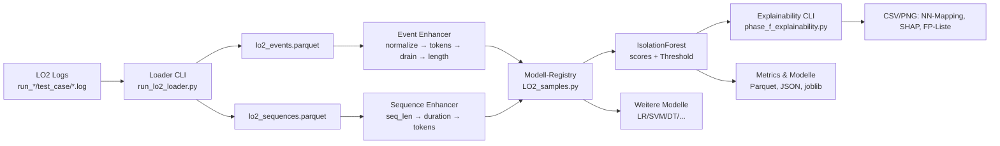

# LO2 Pipeline Überblick

Die LO2-Pipeline zeigt, wie LogLead OAuth2-Logs aus Light-OAuth2 einliest, aufbereitet und für erklärbare Anomalieerkennung nutzt. Dieses Dokument vermittelt das Gesamtbild in wenigen Minuten.

## Zielbild

- **Scope:** Reproduzierbare Ende-zu-Ende-Demo für logbasierte Anomalieerkennung an OAuth2-Microservices.
- **Verantwortung:** Loader, Feature-Pipeline, Modell-Registry und Explainability laufen als Skripte ohne Notebook-Abhängigkeit.
- **Kernversprechen:** Artefakte (Parquet, Modelle, Metriken, XAI) entstehen deterministisch unter `demo/result/lo2/`.
- **Reifegrad:** Pipeline funktionsfähig; Isolation Forest liefert derzeit keine verwertbaren Treffer (Accuracy 0.45, F1 0.0 bei 50 % Fehleranteil). Sequenzbasierte Supervised-Modelle laufen mit run-basiertem Hold-out (20 %) und erzielen hohe Scores (z. B. RF/XGB ≥0.97 Accuracy), benötigen aber größere Stichproben zur Validierung.

## End-to-End-Ablauf

## Artefakte & Pfade (Kurzreferenz)

- `demo/result/lo2/lo2_events.parquet` / `lo2_sequences.parquet`: Loader-Exports.
- `demo/result/lo2/lo2_if_predictions.parquet`: IF-Scores mit Schwelle und Ranking.
- `demo/result/lo2/explainability/`: NN-Mapping, SHAP-Plots, False-Positive-Liste.
- `models/lo2_if.joblib`, `models/model.yml`: Persistierte Isolation-Forest-Bundles inkl. Metadaten.

## Event- vs. Sequenzebene

- **Event-Ebene:** Einzelne Logzeilen (~300 k Events), genutzt von IsolationForest und den meisten Registry-Modellen.
- **Sequenz-Ebene:** Aggregierte Runs pro Service/Testfall (≈ 1 200 Sequenzen bei 200 Runs), Grundlage für `sequence_lr_*` inkl. SHAP-Erklärungen.

## Aktuelles Delta

- **Stärken:** Vollständiger CLI-Fluss, konsistente Ablage, Explainability-Artefakte, Modell-Registry mit 14 Varianten.
- **Schwächen:** IsolationForest verfehlt sämtliche Anomalien trotz angepasster Kontamination. Supervised-Modelle nutzen zwar Hold-out, der Umfang (40 Sequenzen) ist jedoch begrenzt → Overfitting-Gefahr.
- **Nächste Schritte:** Datenbasis verbreitern, Feature-Sets erweitern, Hold-out vergrößern und Ergebnisse zentral protokollieren (Details siehe `roadmap/improvement-plan.md`).

## Aktuelle Benchmarks (Stand 2025-11-05)

- **IsolationForest (`--phase if`, Kontamination 0.45, Hold-out 20 %):** Accuracy 0.45, F1 0.00, AUC 0.00 – Top-Scores stammen aus `correct`-Runs.
- **Supervised Tokens (Hold-out 20 %):**
    - `event_lsvm_words`: Accuracy 0.975, F1 0.974
    - `event_rf_words`: Accuracy 1.000, F1 1.000 (Stichprobe 40 Sequenzen)
    - `event_xgb_words`: Accuracy 0.975, F1 0.976
    - `sequence_shap_lr_words`: Accuracy 0.675, F1 0.667 (liefert SHAP-Artefakte)

## Nächste Schritte

- Mehr "correct"-Runs und zusätzliche Fehlerfälle einspielen, um Hold-out ≥100 Sequenzen zu erreichen.
- IsolationForest als Drift-Monitor überdenken oder Feature-Set (Drain-IDs, numerische Sequenzmetriken) erweitern.
- CLI auf `with_row_index` umstellen, um Deprecation-Warnungen zu vermeiden.
- Exporte unter `demo/result/lo2/metrics` konsolidieren (Notebook/CSV) und Trends dokumentieren.
