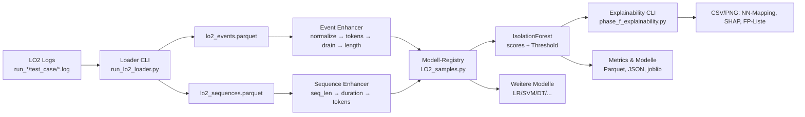

# LO2 Pipeline Überblick

Die LO2-Pipeline zeigt, wie LogLead OAuth2-Logs aus Light-OAuth2 einliest, aufbereitet und für erklärbare Anomalieerkennung nutzt. Dieses Dokument vermittelt das Gesamtbild in wenigen Minuten.

## Zielbild

- **Scope:** Reproduzierbare Ende-zu-Ende-Demo für logbasierte Anomalieerkennung an OAuth2-Microservices.
- **Verantwortung:** Loader, Feature-Pipeline, Modell-Registry und Explainability laufen als Skripte ohne Notebook-Abhängigkeit.
- **Kernversprechen:** Artefakte (Parquet, Modelle, Metriken, XAI) entstehen deterministisch unter `demo/result/lo2/`.
- **Reifegrad:** Pipeline funktionsfähig, aber Isolation Forest erzielt noch schwache Präzision. Supervised-Modelle berichten Trainingsscores ohne eigenen Split.

## End-to-End-Ablauf

## Artefakte & Pfade (Kurzreferenz)

- `demo/result/lo2/lo2_events.parquet` / `lo2_sequences.parquet`: Loader-Exports.
- `demo/result/lo2/lo2_if_predictions.parquet`: IF-Scores mit Schwelle und Ranking.
- `demo/result/lo2/explainability/`: NN-Mapping, SHAP-Plots, False-Positive-Liste.
- `models/lo2_if.joblib`, `models/model.yml`: Persistierte Isolation-Forest-Bundles inkl. Metadaten.

## Event- vs. Sequenzebene

- **Event-Ebene:** Einzelne Logzeilen (~300 k Events), genutzt von IsolationForest und den meisten Registry-Modellen.
- **Sequenz-Ebene:** Aggregierte Runs pro Service/Testfall (≈ 1 200 Sequenzen bei 200 Runs), Grundlage für `sequence_lr_*` inkl. SHAP-Erklärungen.

## Aktuelles Delta

- **Stärken:** Vollständiger CLI-Fluss, konsistente Ablage, Explainability-Artefakte, Modell-Registry mit 14 Varianten.
- **Schwächen:** IsolationForest liefert schwache F1-Werte; Supervised-Modelle laufen ohne Validierungssplit und melden geschönte Trainingsmetriken.
- **Nächste Schritte:** Mehr Normaldaten laden, Feature-Sets erweitern, systematischen Benchmark-Split ergänzen (Details siehe `roadmap/improvement-plan.md`).
