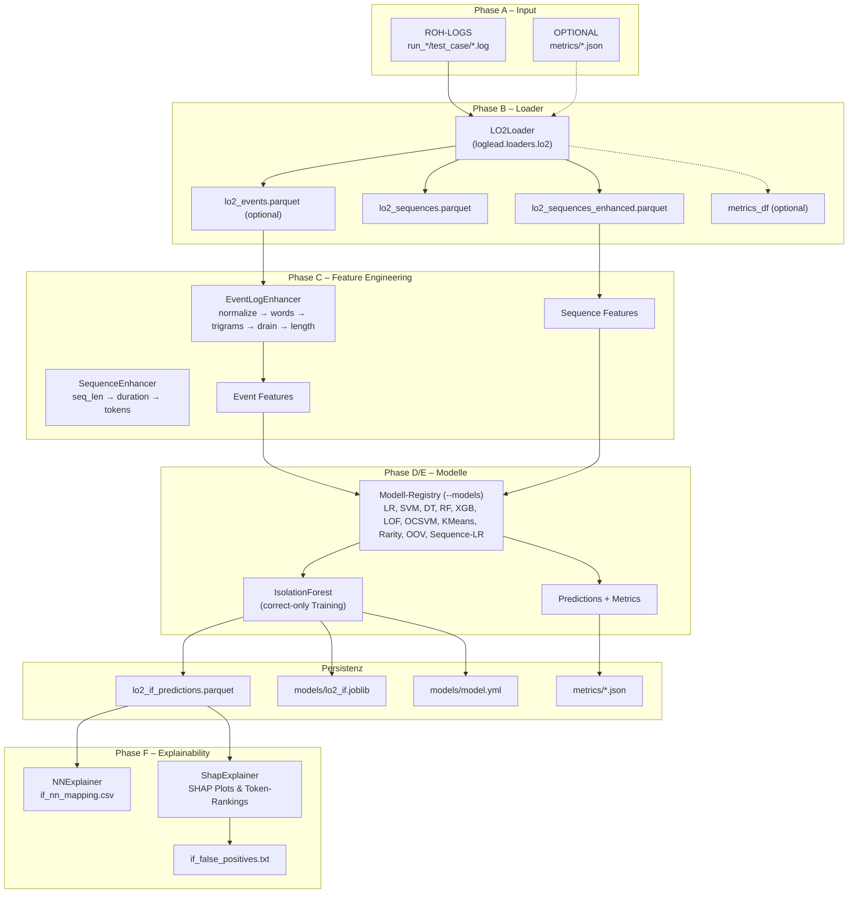

# LO2 Pipeline Architektur

Diese Referenz beschreibt die Bausteine der LO2-Pipeline, ihre Datenflüsse sowie die wichtigsten Konfigurationspunkte.

## Systemübersicht

## Komponenten im Detail

### LO2Loader (`loglead/loaders/lo2.py`)

- Traversiert `run_*`-Ordner, wählt `correct` + Fehlerfälle (`errors_per_run`, `dup_errors`, `single_error_type`).
- Filtert Services via `--service-types` (empfohlen: `code token refresh-token`).
- Entfernt optional die ersten `init_lines_to_skip` Zeilen (Standard 100) zur Vermeidung von Label-Leakage.
- Liefert Polars-DataFrames `df` (Events) und `df_seq` (Sequences) sowie optional `metrics_df`.
- Persistenz über CLI (`--save-parquet`, `--output-dir`); standardmäßig wird `lo2_sequences_enhanced.parquet` geschrieben (Basis-Sequenzen nur via `--save-base-sequences`). Events nur mittels `--save-events`.

### EventLogEnhancer / SequenceEnhancer

- Event-Schritte: `normalize()`, `words()`, `trigrams()`, `parse_drain()`, `length()`.
- Sequence-Schritte: `seq_len()`, `duration()`, `tokens(token="e_words")` (weitere Token-Kombinationen optional).
- Produzieren Feature-Spalten wie `e_words`, `e_trigrams`, `e_event_drain_id`, `seq_len`, `duration_sec`.

### AnomalyDetector & Modell-Registry

- `AnomalyDetector` kapselt Vektorisierung (`CountVectorizer`), Train/Test-Splits, Fit/Predict für Sklearn-Modelle.
- Isolation Forest läuft immer (`filter_anos=True` → Training ausschließlich auf `test_case == "correct"`).
- `MODEL_REGISTRY` (14 Einträge) steuert zusätzliche Modelle über CLI (`--models key1,key2`). Beispiele:
  - `event_lr_words`: LogisticRegression auf Tokenlisten.
  - `event_lof_words`: LocalOutlierFactor mit `novelty=True`.
  - `sequence_shap_lr_words`: Sequence-LR mit SHAP-Erklärungen.
- Trainingsmetriken werden derzeit auf den vollen Daten berechnet; seriöse Benchmarks benötigen einen expliziten Split.

### Explainability

- `NNExplainer`: Cosine-Nearest-Neighbour zwischen Top-IF-Scores und Normalfällen → `if_nn_mapping.csv`, `if_false_positives.txt`.
- `ShapExplainer`: SHAP Summary/Bar-Plots, Top-Token-Listen für ausgewählte Modelle (LR, DT, Sequence-LR).
- Ressourcenbedarf: SHAP-Sampling über `--shap-sample` steuern (200–500 empfohlen).

## Datenartefakte

### Events (optional, `lo2_events.parquet`)

| Spalte | Typ | Beschreibung |
| --- | --- | --- |
| `m_message` | Utf8 | Rohlogzeile |
| `run`, `test_case`, `service` | Utf8 | Kontextinformationen |
| `seq_id` | Utf8 | Run/Test/Service-Key |
| `m_timestamp` | Datetime | Extrahierter Zeitstempel (ISO, Zeit-only) |
| `normal`, `anomaly` | Bool | Label (correct vs. error) |
| `e_words`, `e_trigrams` | List[Utf8] | Tokenlisten |
| `e_event_drain_id` | Utf8 | Drain-Template-ID (wenn verfügbar) |
| `e_chars_len`, `e_lines_len` | Int | Längenmetriken |

### Sequenzen (`lo2_sequences_enhanced.parquet`)

| Spalte | Typ | Beschreibung |
| --- | --- | --- |
| `seq_id` | Utf8 | identisch zu Event-`seq_id` |
| `m_message` | Utf8 | Konkatinierte Events |
| `normal`, `anomaly` | Bool | Sequenzlabel |
| `start_time`, `end_time` | Datetime | Erstes/letztes Event |
| `seq_len`, `duration_sec` | Int/Float | Aggregierte Kennzahlen |
| `e_words`, `e_trigrams` | List[Utf8] | Aggregierte Tokenlisten |
| `e_words_len`, `e_trigrams_len` | Int | Anzahl Tokens/Trigramme |

### Predictions (`lo2_if_predictions.parquet`)

- Enthält Originalspalten plus `pred_if`, `score_if`, `rank_if`, optionale Schwellenwerte (`pred_if_threshold`).
- Metrikdateien (`metrics/*.json|csv`) dokumentieren Precision@k, FP-Rate@α, PSI.

## Skripte & Reihenfolge

1. `demo/lo2_e2e/run_lo2_loader.py` – Phase B, erzeugt Parquets.
2. `demo/lo2_e2e/LO2_samples.py` – Phasen C–E, orchestriert Enhancer, IsolationForest und Registry.
3. `demo/lo2_e2e/lo2_phase_f_explainability.py` – Phase F, generiert Explainability-Artefakte.
4. Zusatz: `tools/lo2_result_scan.py` prüft Artefaktvollständigkeit.

## Konfigurationsoberflächen

| Komponente | Hauptparameter | Hinweise |
| --- | --- | --- |
| Loader | `--runs`, `--errors-per-run`, `--service-types`, `--single-error-type`, `--trim-init-lines`, `--load-metrics` | Stellt Datenumfang ein und schützt vor Dupes. |
| Enhancer | Methodenaufrufe im Code | Anpassungen erfordern Codeänderungen (z. B. zusätzliche Parser). |
| IsolationForest | `--if-contamination`, `--if-item`, `--if-numeric`, `--if-max-samples`, `--if-holdout-fraction`, `--if-threshold-percentile` | Kontamination + Feature-Set entscheidend für Scoreverteilung. |
| Registry | `--models`, `MODEL_REGISTRY` | Schlüssel in Kebab-Case; Sequence-Modelle erwarten `lo2_sequences_enhanced.parquet`. |
| Explainability | `--nn-top-k`, `--nn-normal-sample`, `--shap-sample`, `--if-*` | Sampling reduziert Laufzeit und Speicher. |

## Bekannte Grenzen

- IsolationForest leidet unter hohem False-Positive-Anteil; Trainingsdaten enthalten >50 % Fehler-Events.
- Supervised-Modelle melden Trainingsmetriken; realistischer Vergleich benötigt Train/Test-Splitting.
- Drain-Parsing kann scheitern, wenn Templates fehlen; Fehler werden aktuell geloggt, aber nicht eskaliert.
- Metrikdaten (`metrics_df`) sind implementiert, aber nicht in der Standardpipeline verknüpft.

## Offene Aufgaben

- TODO: Metrics-Join zwischen Loader-Outputs und `metrics_df` definieren.
- TODO: Automatisierten Benchmark-Split (z. B. run-basierter Hold-out) für Registry-Modelle ergänzen.
- TODO: Logging für fehlgeschlagene Parser konsistenter gestalten (Warnlevel, Aggregation).
